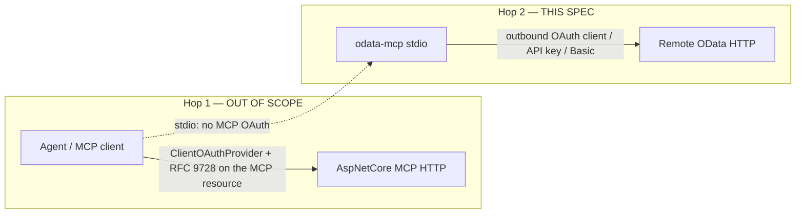
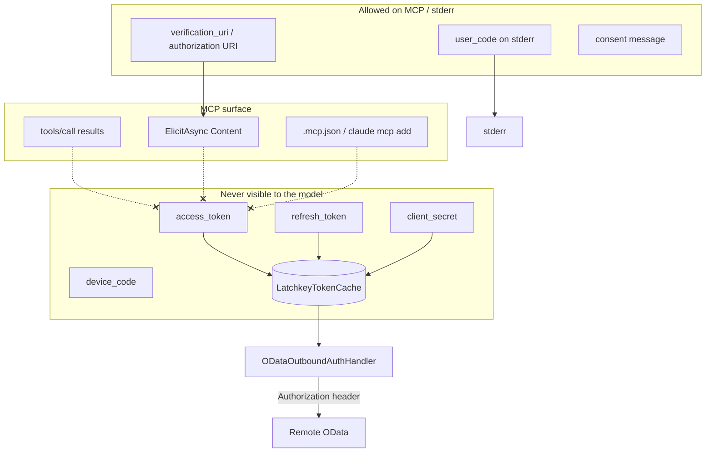

# CLI Outbound Authentication — Remote OData

**Status:** Living (authoritative for CLI → remote OData auth)  
**Author:** TBD  
**Revised:** 2026-09-08 (rev 10 — `AddODataProtectedResource`: the other end of this hop, so an OData API can publish what the discovery algorithm below is looking for; see [Zero-config protected resource (`AddODataProtectedResource`)](#zero-config-protected-resource-addodataprotectedresource) and [Revision notes (rev 10)](#revision-notes-rev-10))  
**Previously:** 2026-09-08 (rev 9 — `ToolsMcpHost.CreateAsync` `configureServices` hook and `verbose`; `OutboundOAuthClient` owns the service root; `PrmCandidates` ordered list; RFC 8707 `resource` gated on advertisement or `--resource`; `VerifyPersistence` on first acquisition, not startup; DCR for client credentials registers `client_secret_post`; see [Revision notes (rev 9)](#revision-notes-rev-9))  
**Protocol:** MCP `2026-07-28` via **ModelContextProtocol C# SDK 2.2**  
**Hop:** `odata-mcp` (stdio) → remote OData HTTP we do not own  
**Not this hop:** agent → MCP HTTP (`ClientOAuthProvider` / RFC 9728 on the MCP resource)

---

## Overview

`odata-mcp` can already paste a bearer onto the named `"OData"` `HttpClient` (`--auth-token`). That is a stolen-token UX: `AddCommand` writes the secret into the MCP config the LLM host loads. This spec replaces that path with vendor-neutral outbound OAuth **as a client of the OData API**.

The operator specifies a URL. The `"OData"` handler reads `ObtainedAt + ExpiresIn` from the cached `TokenContainer`. If remaining lifetime is greater than `TokenRefreshSkew` (30 seconds), it attaches Bearer and sends **one** OData request. If remaining lifetime is ≤ skew or the access token is already expired and a `refresh_token` exists, it refreshes **once** (coalesced), then sends OData. There is **no** background timer: an idle process does not call the token endpoint. First start (empty cache) GETs `$metadata`, reads `401`/`403` `WWW-Authenticate`, discovers Protected Resource Metadata (RFC 9728) and the authorization server (RFC 8414 / OIDC), then completes an advertised grant. Device code (RFC 8628) is first for stdio. Tokens persist in a Latchkey-backed `ITokenCache`. Tokens never enter tool results, elicitation payloads, logs, or `.mcp.json`. A later `odata-mcp start` of the same service root + client id must not re-prompt if a non-expired access token or a `refresh_token` is in the store.

`--auth-token` remains an escape hatch only.

---

## Background & Motivation

### Current state (cite the tree)

| Location | What it does today |
|----------|--------------------|
| [`src/Microsoft.OData.Mcp.Tools/Hosting/ToolsMcpHost.cs`](../../src/Microsoft.OData.Mcp.Tools/Hosting/ToolsMcpHost.cs) `CreateAsync` | One-off `HttpClient` GET `$metadata`. If `authToken` is set, `AuthenticationHeaderValue("Bearer", authToken)`. No discovery. |
| `ToolsMcpHost.BuildStdioHost` | Second `AddHttpClient("OData", …)` that again pastes Bearer when `--auth-token` is set. |
| [`StartCommand.cs`](../../src/Microsoft.OData.Mcp.Tools/Commands/StartCommand.cs) / [`TestCommand.cs`](../../src/Microsoft.OData.Mcp.Tools/Commands/TestCommand.cs) | `-t|--auth-token` only. McMaster `[Option]`. |
| [`AddCommand.cs`](../../src/Microsoft.OData.Mcp.Tools/Commands/AddCommand.cs) `PromptForAuthentication` | Interactive **Bearer Token / API Key / Basic Auth**. `BuildMcpCommand` embeds `--auth-token` **and** `--env ODATA_AUTH_TOKEN=…`. API key is sent as `Bearer`. |
| [`RemoteODataExecutor.cs`](../../src/Microsoft.OData.Mcp.Core/Execution/RemoteODataExecutor.cs) | Named client `"OData"` (`HttpClientName`). Forwards method/path/body. No auth of its own. |
| [`ODataExecuteResult.FromHttp`](../../src/Microsoft.OData.Mcp.Core/Execution/ODataExecuteResult.cs) | Copies status, body, media type, `Retry-After`. **Drops `WWW-Authenticate`.** |
| [`AddODataMcpCore`](../../src/Microsoft.OData.Mcp.Core/Extensions/ODataMcp_Core_ServiceCollectionExtensions.cs) | Registers named `"OData"` + `RemoteODataExecutor` for tests. CLI already calls `AddHttpClient("OData")` itself. Core must not grow an Authentication reference. |
| [`Microsoft.OData.Mcp.Authentication`](../../src/Microsoft.OData.Mcp.Authentication/) | Package exists; `Outbound/` types land in PR 2. Tools ProjectReferences it. AspNetCore does not. |
| [`specs/v3/ARCHITECTURE.md`](./ARCHITECTURE.md) | Authentication = outbound OAuth (CLI → remote OData). Tools optional → Authentication. AspNetCore does not. Core never. |

### Pain

1. Protected OData (Graph, SAP, Dynamics, custom Entra APIs) cannot be used without a pre-stolen bearer.
2. `add` writes long-lived secrets into Claude MCP config. The model-adjacent host process sees them.
3. API key is mis-typed as Bearer.
4. `CreateAsync` builds a throwaway `ServiceCollection`/`IHttpClientFactory` for the session executor, then `BuildStdioHost` registers a **different** named client. Unify that while wiring auth.
5. Graph’s `/.well-known/oauth-protected-resource` is not anonymously readable. Naive RFC 9728 clients die.

### Two hops — do not confuse them



- **Hop 1** is SDK `ClientOAuthProvider`: it authenticates an **MCP client (agent) to an MCP HTTP server** (RFC 9728 on the MCP resource). It is not an OData client and not a generic `HttpClient` handler. Stdio has no MCP OAuth, so hop 1 does not apply to `odata-mcp`. Do not start inbound MCP OAuth on `Microsoft.OData.Mcp.AspNetCore`. Do not mix `Add` vs `Use` via `IStartupFilter`. Do not invent Restier host helpers.
- **Hop 2** is this document: credentials on **OData HTTP** (`$metadata` and data), same target as today’s `--auth-token`, without pasting a bearer into MCP config. Do **not** attach `ClientOAuthProvider` to the `"OData"` `HttpClient`.

Reuse SDK **types** (PRM, `ITokenCache`, DCR, callback/PKCE, `TokenContainer`, `ScopeSelector`, Identity Assertion Grant). Build our own outbound handler for OData HTTP.

---

## Goals & Non-Goals

### Goals

- Operator specifies a URL. CLI discovers how to authenticate and completes an OAuth cycle without `--auth-token`.
- Vendor-neutral. Graph is one protected OData example, not the design center.
- Discovery: `401 WWW-Authenticate` (`resource_metadata`, `authorization_uri`, …) → RFC 9728 PRM (origin and path-prefixed) → RFC 8414 then `openid-configuration`.
- Survive Graph’s well-known `401 InvalidAuthenticationToken`.
- Grants from **advertised** metadata: device code first for stdio; auth code + PKCE + loopback second; client credentials for daemons; Identity Assertion Grant when configured.
- API key / Basic only as **explicit** flags, never guessed from HTML 401 pages.
- Tokens never go through the LLM. Elicitation is consent UX (open a URL / show a device code), not a token ferry.
- Generic client identity: DCR if `registration_endpoint`, else `--client-id`. Never treat Graph challenge `client_id` `00000003-0000-0000-c000-000000000000` as our public client id.
- `--auth-token` escape hatch only.
- Core stays Authentication-free. One class per file. AOT-first Tools.

### Non-goals

| Non-goal | Why |
|----------|-----|
| Inbound MCP OAuth on AspNetCore | Wrong hop. Later spec. |
| Wiring `ClientOAuthProvider` onto `"OData"` | That type is MCP agent → MCP HTTP server only. Stdio MCP is unauthenticated; OData (including `$metadata`) is authenticated by **our** outbound handler, not by the SDK MCP client. |
| MSAL / Graph-only SDK | Not vendor-neutral. |
| Shipping a first-party Entra client id | Operator always supplies `--client-id` for Entra. |
| Guessing API keys from HTML | Fail first. |
| Core referencing Authentication | [ARCHITECTURE](./ARCHITECTURE.md) / [README](./README.md) **hard rule 11**. |
| Nested types / new DI interfaces | One class per file. Implement SDK `ITokenCache`; do not wrap it. |
| Changing `global.json` | Not asked. |
| Mocking `HttpClient` / OData / MCP / Graph | [`TESTING.md`](./TESTING.md). |

---

## Hard rules (this spec)

Numbered **AUTH-n** so they do not collide with [README](./README.md) / [ARCHITECTURE](./ARCHITECTURE.md) hard rules. README **hard rule 11** remains “Core does not reference Authentication” (restated here as AUTH-3). AUTH-11 is the passthrough rule (TOOL-TEST-MANIFEST global rule 2), not that package rule.

| Id | Rule |
|----|------|
| **AUTH-1** | **Official MCP only.** SDK 2.x pinned. No `0.*-*`. |
| **AUTH-2** | **This is hop 2.** `ClientOAuthProvider` is MCP **agent → MCP HTTP server** authentication only. Do not reuse it as “call Graph” or as the `"OData"` handler. Proof it is MCP-client scoped: [`ClientOAuthOptions.RedirectUri` is `required`](https://csharp.sdk.modelcontextprotocol.io/v2/api/ModelContextProtocol.Authentication.ClientOAuthOptions.html) and options comments describe the MCP transport. The v2 doc page for `ClientOAuthProvider` itself 404s (2026-09-07); the type is still referenced from `ClientOAuthOptions` and may exist in `ModelContextProtocol.Core.dll`. |
| **AUTH-3** | **Core does not ProjectReference `Microsoft.OData.Mcp.Authentication`.** That is *our* outbound OAuth package (`Outbound/`). It is **not** `ModelContextProtocol.Authentication`. Core already PackageReferences `ModelContextProtocol` 2.*, and those SDK types (`ProtectedResourceMetadata`, `ITokenCache`, `TokenContainer`, …) live in `ModelContextProtocol.Core.dll` — Core may `using` that namespace. At most generic HTTP challenge **strings** on `ODataExecuteResult`. `RemoteODataExecutor` does not retry and does not parse challenges. |
| **AUTH-4** | **Tools may reference Authentication.** Outbound types live under `Microsoft.OData.Mcp.Authentication.Outbound`. AspNetCore does not ProjectReference this package. |
| **AUTH-5** | **One class per file.** No nested types in *our* source. Source-generated `JsonSerializerContext` nested `JsonTypeInfo` is the compiler’s, not ours. Wire DTOs (`DeviceAuthorizationResponse`, `TokenEndpointResponse`, `OutboundGrantKind`) are top-level files. |
| **AUTH-6** | **Constants** for protocol strings in one flat class, same pattern as [`ODataMcpCatalogConstants`](../../src/Microsoft.OData.Mcp.Core/Constants/ODataMcpCatalogConstants.cs). |
| **AUTH-7** | **No new DI interfaces** unless unavoidable. Prefer concrete types. Implement `ITokenCache`; do not invent `IOutboundTokenCache`. |
| **AUTH-8** | **Defense in depth, fail first.** `ArgumentException.ThrowIfNullOrWhiteSpace`, `ArgumentNullException.ThrowIfNull`, `is null` / `is not null`, `.IsNullOrWhiteSpace()`. |
| **AUTH-9** | **Public members first.** No `private` methods (fields only). Alphabetical within visibility. Normal namespaces. Newline before `{`. |
| **AUTH-10** | **XML docs** on public APIs. `<param>` on the same line as content. `<remarks>` last. |
| **AUTH-11** | **MCP is a passthrough.** Do not inject query values the caller did not specify. |
| **AUTH-12** | **Access/refresh tokens never** in logs, tool `structuredContent`, elicitation `Content`, MCP config, or environment variables written by `add`. API key / Basic in generated MCP config are a residual, warned risk (see CLI UX). |
| **AUTH-13** | **Challenge `client_id` is the resource app id** unless PRM/AS metadata explicitly says otherwise. Graph: `00000003-0000-0000-c000-000000000000` is **not** the CLI client id. |
| **AUTH-14** | **Well-known 401, 403, 404, and failed parse are not fatal.** Continue with `WWW-Authenticate` + `--auth-server`. Fail only when no AS can be selected after those fallbacks. Timeout/5xx: retry the well-known GET once, then fail first with URL and status. |
| **AUTH-15** | **Tests:** Breakdance + real HTTP. Local test authorization server + protected resource in the test project. Optional live probes that `Assert.Inconclusive` without credentials. Never mock Graph, `HttpClient`, OData, or MCP. Sequential `dotnet` with `-c Debug`. |

---

## Proposed Design

### Package placement

```
Core            — ODataExecuteResult.WwwAuthenticate (raw header values). No OAuth types.
Authentication  — Outbound/ (discovery, grants, cache, handler, constants)
Tools           — CLI flags, ToolsMcpHost wiring, add wizard, stdio consent / elicitation
AspNetCore      — unchanged. Inbound MCP OAuth is a later spec. Does not reference this package.
```

```
Tools ─optional─► Authentication
AspNetCore ─ ✗ ─► Authentication
Core ───────────► no Authentication
Authentication ─► ModelContextProtocol 2.x  (PRM / TokenContainer / ITokenCache / DCR)
```

Outbound lives in `Authentication/Outbound` so Tools stays a thin host. Cache and runtime tokens are SDK `TokenContainer`. Wire JSON is `TokenEndpointResponse`. JSON source-gen; no reflection.

### Type map (one class per file)

All new production types: copyright header, normal namespace, `#region` Fields / Properties / Constructors / Public Methods / Private Methods (Private region empty except fields), public then internal, alphabetical.

#### Core

| Type | Job |
|------|-----|
| `ODataExecuteResult` (evolve, `Execution`) | Add `IReadOnlyList<string> WwwAuthenticate { get; set; }`. `FromHttp` copies **raw** `TryGetValues("WWW-Authenticate")` only (lossless; `AuthenticationHeaderValue.ToString()` drops quoting). Deduplicate identical values. Do not parse OAuth params here. `RemoteODataExecutor` does not retry. |
| `RemoteODataExecutor` (evolve, `Execution`) | PR 4b: set `Accept: application/json` on each `HttpRequestMessage`. No Authentication types. |
| `ODataMcpHandlerExtensions` (evolve, `Catalog`) | Add optional `tryHandleCallException` that runs in `try/catch` **around** `session.Runtime.InvokeAsync`. Signature: `Func<RequestContext<CallToolRequestParams>, Exception, CancellationToken, ValueTask<CallToolResult?>>?`. **Contract:** non-null return is the tool result (do not treat elicit Content as the result); `null` means Core **rethrows**. One retry of `InvokeAsync` is Tools’ job inside the callback, not Core’s. Core still has no Authentication reference. **`tryHandleExtra` stays pre-invoke** (shutdown_server) and cannot see OData 401s. |

No `HttpAuthenticationChallenge` in Core unless a second consumer needs generic RFC 9110 parsing independent of OAuth. First PR: raw strings only.

#### Authentication outbound (`Microsoft.OData.Mcp.Authentication.Outbound`)

| Type | Job |
|------|-----|
| `ODataMcpAuthConstants` | Header names, well-known suffixes, grant URIs, WWW-Authenticate param names, Graph resource-app-id sentinel. Flat `const string` fields, alphabetical. |
| `OutboundOAuthOptions` | Operator + discovered settings. **Not** `ClientOAuthOptions` (that type is for `ClientOAuthProvider`). |
| `OAuthChallenge` | Parsed Bearer/OAuth challenge: `Scheme`, `Realm`, `Scope`, `ResourceMetadata`, `AuthorizationUri`, `Error`, `ResourceClientId` (challenge `client_id`), raw params. |
| `WwwAuthenticateParser` | RFC 9110 / RFC 6750 parameter parser → `OAuthChallenge`. Fail first on empty input. |
| `ProtectedResourceMetadataClient` | GET PRM URLs on the **`"OAuth"`** client (no handler). Deserialize to SDK `ProtectedResourceMetadata`. Non-fatal skip on 401, 403, 404, and failed parse. Timeout/5xx: retry once, then throw with URL and status. |
| `AuthorizationServerMetadata` | RFC 8414 / OIDC document we actually read: issuer, endpoints, `grant_types_supported`, `scopes_supported`, `registration_endpoint`, `client_id_metadata_document_supported`, PKCE methods, `code_challenge_methods_supported`. One class, no nested token-endpoint types. |
| `AuthorizationServerMetadataClient` | RFC 8414 then OIDC, on the `"OAuth"` client. Absolute URIs only. |
| `OAuthDiscovery` | Orchestrates the algorithm in §Discovery. Returns `OAuthDiscoveryResult`. Uses `"OAuth"` for well-known; never the `"OData"` pipeline. |
| `OAuthDiscoveryResult` | PRM (nullable), AS metadata (nullable), challenge, selected AS URI, selected scopes, selected resource, advertised grants. |
| `OutboundGrantKind` | Top-level enum: `DeviceCode`, `AuthorizationCode`, `ClientCredentials`, `IdentityAssertion`, `RefreshToken`. `OutboundOAuthOptions.Grant` is this type. One file. |
| `DeviceAuthorizationResponse` | RFC 8628 start JSON (`device_code`, `user_code`, `verification_uri`, `verification_uri_complete`, `interval`, `expires_in`). Snake_case `[JsonPropertyName]`. One file. |
| `TokenEndpointResponse` | RFC 6749 token JSON (`access_token`, `token_type`, `expires_in`, `refresh_token`, `scope`). Snake_case `[JsonPropertyName]`. Maps to SDK `TokenContainer` with `ObtainedAt = DateTimeOffset.UtcNow`. One file. **Not** `TokenContainer` — that type is PascalCase and cache/runtime only. |
| `GrantSelector` | Picks `OutboundGrantKind` from advertised `grant_types_supported` + options. Throws on a kind whose grant class is not yet registered (message names the unimplemented grant). |
| `DeviceCodeGrant` | RFC 8628. Deserializes `DeviceAuthorizationResponse` / `TokenEndpointResponse` via `OutboundOAuthJsonContext`. POSTs on `"OAuth"`. |
| `AuthorizationCodePkceGrant` | RFC 8252 + RFC 7636 S256. Returns SDK `AuthorizationResult` (code, state, iss). Token POST on `"OAuth"`. |
| `ClientCredentialsGrant` | RFC 6749 client_credentials. Secret only in v1 (no cert). Token POST on `"OAuth"`. |
| `RefreshTokenGrant` | `grant_type=refresh_token`. Token POST on `"OAuth"`. Called from the handler when remaining access-token lifetime is ≤ `TokenRefreshSkew` or the token is already expired, and as a fallback on 401 `invalid_token`. |
| `DynamicClientRegistrar` | RFC 7591 using SDK `DynamicClientRegistrationOptions` / `DynamicClientRegistrationResponse`. POST on `"OAuth"`. |
| `ScopeResolver` | Challenge `scope` → PRM `scopes_supported` → `--scopes` → omit; append `offline_access` if advertised; **then** optional SDK `ScopeSelectorDelegate` (may remove `offline_access`). |
| `ODataOutboundAuthHandler` | `DelegatingHandler` on named `"OData"` **only**. Must not be registered on `"OAuth"`. Must not take `McpServer` or any Tools type. **Read `options.ConsentPresenter` on each 401** (`IHttpClientFactory` may cache the handler; do not copy the Func in the ctor). **Before `SendAsync`:** if `--auth-token` / API key / Basic is set, attach that and skip OAuth. Else `GetTokensAsync`. Remaining = `ObtainedAt + ExpiresIn − now`. If remaining > `TokenRefreshSkew`, attach Bearer and send — **no** token POST. If remaining ≤ `TokenRefreshSkew` (including already expired) and a `refresh_token` is present, one coalesced `RefreshTokenGrant`, store, attach, send. If `ExpiresIn` is absent, attach and send; 401 is the fallback. **After the response:** (a) no `Authorization` and 401/403 → discover/acquire (Graph `$metadata` has `authorization_uri`, not `error=invalid_token`). On success, attach Bearer and retry once on a **new** `HttpRequestMessage`. (b) Bearer + `invalid_token` → refresh once if this send did not already, retry once on a new message; else (c). (c) refresh fails or no refresh token → presenter or `OAuthConsentRequiredException`. Two concurrent sends that both see remaining ≤ skew share **one** refresh (`SemaphoreSlim` on `OutboundOAuthClient`). |
| `LatchkeyTokenCache` | **Implements SDK `ITokenCache`.** One slot per instance. Backing store is [Latchkey](https://www.nuget.org/packages/Latchkey) (`PackageReference` `Latchkey`). Do not invent `ICredentialStore` / `IOutboundTokenCache`. Never log payload. See §Data Model. |
| `LoopbackAuthorizationCallback` | `HttpListener` on `http://127.0.0.1:{port}/callback/`. Builds `AuthorizationCallbackContext` / `AuthorizationResult`. Validates `state`. Captures RFC 9207 `iss`. |
| `FileIdTokenCallback` | `IdentityAssertionGrantIdTokenCallback` that reads a UTF-8 id token from `--idp-id-token-file` or env `ODATA_MCP_ID_TOKEN`. Not argv. One class. |
| `IdentityAssertionGrant` | Our RFC 8693 + 7523 POSTs. Used **only** if SDK `IdentityAssertionGrantProvider` hard-codes MCP well-known paths. One file; do not nest inside `OutboundOAuthClient`. |
| `OutboundConsentRequest` | URL, `ElicitationId`, message, optional `user_code` / verification URI. Passed to `OutboundOAuthOptions.ConsentPresenter`. One file. |
| `OAuthConsentRequiredException` | Thrown by `ODataOutboundAuthHandler` when interactive consent is required and `ConsentPresenter` is null (mid-session). Properties match `OutboundConsentRequest`. Lives in **Authentication.Outbound**, not Tools. One file. |
| `OutboundOAuthClient` | Facade: discover → identify client → acquire → cache. Discovery and grants use `"OAuth"`. Public methods include `StartInteractiveGrantAsync` (returns `OutboundConsentRequest` after device-code start or PKCE loopback listen) and `CompleteInteractiveGrantAsync` (device-code poll / PKCE code exchange → `TokenContainer` → cache). Handler must not call Complete on the `"OData"` send path. **In-flight state:** Start stores pending grant in **internal fields** on this instance (`device_code`, `interval`, `code_verifier`, expected `state`, live `HttpListener`). Those fields are **not** on `OutboundConsentRequest` and **never** go in elicitation. One pending grant at a time (`SemaphoreSlim`); a second Start **fails first**. Complete consumes and **clears** the fields. Tools on `ElicitAsync` decline/timeout: cancel the `CancellationToken` passed to Complete (do not leave the listener/poll running). If those fields outgrow a flat field list, add top-level `PendingInteractiveGrant.cs` (one class, no nested types) — do not nest inside the client. |
| `OutboundAuthLogRedactor` | Concrete log helper: never writes `Authorization` header values or `TokenContainer` / token-endpoint JSON fields. Tests assert a dummy `TokenContainer` does not appear in a captured logger. |
| `OutboundOAuthJsonContext` | `JsonSerializerContext` source-gen for `AuthorizationServerMetadata`, `DeviceAuthorizationResponse`, `TokenEndpointResponse`, and any PRM re-serialize. AOT. |

Do **not** add `IOutboundOAuthClient`. Tests construct `OutboundOAuthClient` directly (Breakdance for DI where the host already uses it).

#### Tools (`Microsoft.OData.Mcp.Tools`)

| Type | Job |
|------|-----|
| `ToolsMcpHost` (evolve) | One `IHost` built in `CreateAsync`. Public `Host` property for `RunAsync`. Two named clients. Metadata GET after `Build()`. `CreateAsync(serviceUrl, options, includeStdioMcp, cancellationToken)`. |
| `ToolsMcpSessionHolder` | Mutable holder registered **before** `Build()`. `Session` assigned after `$metadata` parse. `resolveSession` is `sp => sp.GetRequiredService<ToolsMcpSessionHolder>().Session`. One file. |
| `StartCommand` / `TestCommand` (evolve) | New flags. Map onto `OutboundOAuthOptions`. Bind `ODATA_MCP_CLIENT_SECRET` and `ODATA_MCP_ID_TOKEN` from the environment when the matching option is unset. `start` calls `CreateAsync(..., includeStdioMcp: true)` then `host.RunAsync`. **`BuildStdioHost` is deleted.** |
| `AddCommand` (evolve) | Discover / Device code / Auth code / Client credentials / API key / Basic / Paste token (escape). Generated command stores URL + `--client-id` + `--scopes`. **`--token-cache` only if the operator chose a non-default path.** **No bearer.** Client credentials: **do not emit `--env`**. Wizard text: set `ODATA_MCP_CLIENT_SECRET` in the environment that launches the MCP host; `start` reads it. API key / Basic in the command are residual risk (warned). |
| `StdioConsentPresenter` | Tools adapter assigned to `OutboundOAuthOptions.ConsentPresenter`. Stderr + OS browser. **Must not require `McpServer`.** Never returns tokens. **PR 4b leaves this set** for the process (stderr blocking on refresh-fail). **PR 8** adds `tryHandleCallException` **then** nulls `ConsentPresenter` after metadata so mid-session uses the exception path. |

### Two named HttpClients

`RemoteODataExecutor.HttpClientName` is `internal const` on the executor. `Directory.Build.props` `InternalsVisibleTo` is test assemblies only, **not** Tools. Do **not** make `HttpClientName` public for this work. Tools today uses the literal `"OData"`. After Authentication/Outbound exists, Tools uses `ODataMcpAuthConstants.ODataHttpClientName` (`"OData"`) and `ODataMcpAuthConstants.OAuthHttpClientName` (`"OAuth"`). Core tests may keep using `RemoteODataExecutor.HttpClientName`.

| Name | Handler? | BaseAddress | Used for |
|------|----------|-------------|----------|
| `"OData"` | `ODataOutboundAuthHandler` | service root | `$metadata` (Accept XML) and `RemoteODataExecutor` (Accept JSON per request) |
| `"OAuth"` | **none** | none | PRM, AS metadata, device-code, token, DCR, refresh. Absolute URIs only |

A PRM 401 on `"OAuth"` never enters the handler, so it cannot recurse into discovery. Test: Graph-like PRM 401 produces **one** GET, not N.

```csharp
services.AddHttpClient(ODataMcpAuthConstants.ODataHttpClientName, client =>
{
    client.BaseAddress = root;
})
.AddHttpMessageHandler(sp => sp.GetRequiredService<ODataOutboundAuthHandler>());

services.AddHttpClient(ODataMcpAuthConstants.OAuthHttpClientName);

services.AddSingleton(options);
services.AddSingleton<LatchkeyTokenCache>();
services.AddSingleton<ITokenCache>(sp => sp.GetRequiredService<LatchkeyTokenCache>());
services.AddTransient<ODataOutboundAuthHandler>();
services.AddSingleton<OutboundOAuthClient>();
services.AddSingleton<ToolsMcpSessionHolder>();
```

Do **not** set a default `Accept` on `"OData"`. Per-request:

- Metadata GET: `Accept: application/xml` (`ODataMcpCatalogConstants.ApplicationXml`). `CsdlParser.ParseFromString` is XML-only (`XDocument.Parse`). A JSON default 406s or returns JSON CSDL the parser cannot read.
- Data calls in `RemoteODataExecutor`: set `Accept: application/json` (`ODataMcpCatalogConstants.ApplicationJson`) on each `HttpRequestMessage` in PR 4b (`RemoteODataExecutor.cs`). No Authentication types. Tests.Core live query still succeeds.

Escape hatch: if `OutboundOAuthOptions.AuthToken` is set, the handler sends `Authorization: Bearer {token}` and **does not** refresh or discover.

API key: handler sets `OutboundOAuthOptions.ApiKeyHeader` (required when `--api-key` is set). Fail first if the header name is missing. Do not default to Bearer.

Basic: handler sets `Authorization: Basic {base64}`.

### Unify `ToolsMcpHost` lifetime

Today `CreateAsync` uses a throwaway `new HttpClient()` for `$metadata` (Accept XML), a throwaway `ServiceCollection`/`AddHttpClient("OData")` for `RemoteODataExecutor`, then `BuildStdioHost` registers a **third** `"OData"` client the session executor never uses (`ToolsMcpHost.cs` ~89–117 vs ~150–162). `IHttpClientFactory` cannot be moved between `ServiceProvider`s. After `builder.Build()` the collection is frozen — **do not `AddSingleton` after `Build()`. Do not `ConfigureServices` after `Build()`.**

**Single mechanism (delete the others):**

1. `CreateAsync(string serviceUrl, OutboundOAuthOptions options, bool includeStdioMcp, CancellationToken cancellationToken)` creates one `Host.CreateApplicationBuilder()`.
2. Register parser, `"OData"` + handler, `"OAuth"` (no handler), executor, options, cache, `OutboundOAuthClient`, and a `ToolsMcpSessionHolder` singleton (**empty `Session`**). Assign `options.ConsentPresenter` to `StdioConsentPresenter.PresentAsync` (stderr/browser). No `McpServer` on that presenter.
3. If `includeStdioMcp` is **true** (`start` only): on this builder, **before `Build()`**, `AddMcpServer().WithStdioServerTransport().WithODataCatalogHandlers(resolveSession: sp => { var session = sp.GetRequiredService<ToolsMcpSessionHolder>().Session; ArgumentNullException.ThrowIfNull(session); return session; }, listExtraTools: …, tryHandleExtra: shutdown, tryHandleCallException: elicit lambda)`. Logging to stderr is on this builder. If `includeStdioMcp` is **false** (`test` / `add`): do not call `AddMcpServer`.
4. `var host = builder.Build()`. **This is the only `Build()`.**
5. Call `Latchkey.VerifyPersistence` for the configured service name. If it returns `false` and no `--auth-token` / API key / Basic is set, **fail first** (`Credential store is not usable on this host; unlock the OS keyring or pass --token-cache.`). Then GET `$metadata` from `host.Services.GetRequiredService<IHttpClientFactory>().CreateClient(ODataMcpAuthConstants.ODataHttpClientName)` with `Accept: application/xml`. The handler attaches Bearer when remaining lifetime > `TokenRefreshSkew`. First start (empty cache): 401 → discover/acquire via `ConsentPresenter` → retry that GET once with Bearer. Restart with remaining > skew: **one** `$metadata` GET, no token endpoint, no device code. Restart with remaining ≤ skew or expired + `refresh_token`: one refresh POST then `$metadata`. Idle host: **zero** token-endpoint traffic.
6. Parse CSDL. Construct `ODataMcpCatalog` / `ODataMcpSession`. Assign `host.Services.GetRequiredService<ToolsMcpSessionHolder>().Session = session`. Also set `ToolsMcpHost.Session`.
7. **PR 4b: leave `ConsentPresenter` set** (stderr/blocking) for the whole process so refresh-fail still works before PR 8. **PR 8 only:** after metadata, if `includeStdioMcp`, set `options.ConsentPresenter = null` so later 401s throw instead of blocking stdio. Read the property on each 401; do not snapshot it in the handler ctor.
8. Return `new ToolsMcpHost(host, session)`. `StartCommand` calls `CreateAsync(..., includeStdioMcp: true)` then `await toolsHost.Host.RunAsync(...)`. **Delete `BuildStdioHost`.** `TestCommand` / `add` pass `includeStdioMcp: false`.

Do not paste Bearer in three places. Do not `new HttpClient()` for metadata.

**Consent vs `McpServer` (no Tools ↔ Authentication cycle):**

- `OAuthConsentRequiredException` and `OutboundConsentRequest` live in `Microsoft.OData.Mcp.Authentication.Outbound`. Authentication must not reference Tools.
- `ODataOutboundAuthHandler` takes `OutboundOAuthOptions` only. **Read `ConsentPresenter` on each 401.**
- **Split start vs complete.** Interactive need never polls on the `"OData"` handler thread.
  - Presenter non-null (startup / PR 4b until PR 8): `StartInteractiveGrantAsync` then await `ConsentPresenter` (stderr; presenter may call `CompleteInteractiveGrantAsync`).
  - Presenter null (PR 8+ mid-session): `StartInteractiveGrantAsync` (device-code **start** POST or PKCE loopback listen + authorization URI), fill `OutboundConsentRequest` (`Url`, `ElicitationId`, optional `user_code`), **throw**. Do not poll here.
- Exception bubbles from the handler through `RemoteODataExecutor` through `ODataToolRuntime.InvokeAsync`. **`tryHandleExtra` runs before `InvokeAsync` and cannot catch this.**
- Core `tryHandleCallException` wraps `InvokeAsync`. If the callback returns non-null, that **is** the tool result. If it returns null, Core **rethrows**. Do not treat elicit Content as the tool result.
- Tools callback (PR 8):
  1. If `ex` is not `OAuthConsentRequiredException`, return null (Core rethrows).
  2. `ElicitAsync` URL payload (`Mode=url`, `Url`, `ElicitationId`, message). Content/schema have no token fields and no `device_code`. URL-mode returns when the user **accepts opening the URL**, not when the AS issues tokens.
  3. **In parallel / immediately after accept:** `OutboundOAuthClient.CompleteInteractiveGrantAsync` on `"OAuth"` (device-code poll / PKCE loopback wait + token POST → cache).
  4. On success, **`InvokeAsync` once more** with the same name/args and return that `CallToolResult`. **One retry** after a successful grant, not a loop.
  5. On decline, timeout, or grant failure: **cancel** the `CancellationToken` passed to `CompleteInteractiveGrantAsync` (clears pending grant / loopback). Tool `isError` with no secrets (“sign-in declined or timed out; re-run `odata-mcp start` if needed”).
  - **stdio, no URL elicitation:** skip step 2; `isError` as in step 5 (or stderr device-code if still viable).
  - **Tools HTTP (only if enabled):** throw `UrlElicitationRequiredException` (−32042) with the same URL + `ElicitationId`. Do not call `ElicitAsync`. Retry is the client’s job after −32042.

Delete the `CreateAsync(serviceUrl, authToken, …)` overload in PR 4a. Do not keep a tracked dual API through PR 7.

---

## Discovery algorithm

Fail first. Vendor-neutral. Graph is a trap, not a special case in the happy path.

```mermaid
sequenceDiagram
  participant CLI as OutboundOAuthClient
  participant RS as OData resource
  participant PRM as RFC 9728 well-known
  participant AS as Authorization server

  CLI->>CLI: ITokenCache.GetTokensAsync
  alt remaining lifetime > TokenRefreshSkew
    CLI->>RS: GET $metadata Authorization Bearer
    RS-->>CLI: CSDL
  else remaining ≤ skew or expired, refresh_token present
    CLI->>AS: grant_type=refresh_token
    AS-->>CLI: TokenContainer → ITokenCache
    CLI->>RS: GET $metadata Authorization Bearer
    RS-->>CLI: CSDL
  else empty cache
    CLI->>RS: GET $metadata (no Authorization)
  alt 200
    RS-->>CLI: CSDL
  else 401/403
    RS-->>CLI: WWW-Authenticate
    CLI->>CLI: WwwAuthenticateParser
    alt resource_metadata present
      CLI->>PRM: GET resource_metadata URL
    else
      CLI->>PRM: GET origin /.well-known/oauth-protected-resource
      CLI->>PRM: GET path-prefixed /.well-known/oauth-protected-resource{path}
    end
    Note over CLI,PRM: PRM/AS GETs use named client "OAuth" (no handler)
    alt PRM 401/403/404/unparseable
      PRM-->>CLI: skip (Graph trap or no RFC 9728)
      Note over CLI: non-fatal; keep challenge + operator overrides
    else PRM 200
      PRM-->>CLI: ProtectedResourceMetadata
    else PRM 5xx/timeout
      PRM-->>CLI: retry once then fail with URL+status
    end
    CLI->>AS: GET v2.0 well-known then unversioned RFC 8414/OIDC
    alt first document with token_endpoint
      AS-->>CLI: metadata
    end
    AS-->>CLI: grant_types_supported, registration_endpoint, …
    CLI->>CLI: GrantSelector + client id (DCR or --client-id)
    CLI->>AS: device_code / auth_code+PKCE / client_credentials
    AS-->>CLI: TokenContainer → ITokenCache
    CLI->>RS: GET $metadata Authorization Bearer
    RS-->>CLI: CSDL
  end
  end
```

### Steps

1. **Explicit credentials short-circuit.** If `--auth-token`, `--api-key`, or Basic flags are set → attach them; skip OAuth and the Latchkey store. GET `$metadata` immediately.
2. **Restart / cache-first.** Handler `GetTokensAsync` **before** every `"OData"` send (including `$metadata`). If remaining lifetime > `TokenRefreshSkew`, attach Bearer and send — **one** HTTP call. If remaining ≤ skew or expired and a `refresh_token` exists, one coalesced refresh then send. Do **not** send an anonymous `$metadata` GET when a still-valid access token is in the store. Do **not** refresh on a timer while idle.
3. **On 401/403 after that send, parse `WWW-Authenticate`.** Empty cache (first start) is the usual case that reaches here. Support `Bearer` and OAuth params: `realm`, `scope`, `resource_metadata`, `authorization_uri`, `error`, `error_description`, `client_id`. Store challenge `client_id` as `OAuthChallenge.ResourceClientId`. **Never** copy it onto `OutboundOAuthOptions.ClientId` unless AS metadata has an explicit “use this as public client id” field (none of the RFCs do; so: never). If the status is 401/403 and `WwwAuthenticate` is empty (HTML login page): **fail first** with `{status} with no WWW-Authenticate; pass --auth-token / --api-key-header / --auth-server.` Do not scrape HTML.
4. **Fetch RFC 9728 PRM** into SDK `ProtectedResourceMetadata` via named client `"OAuth"` (no handler, absolute URIs):
   - URL from `resource_metadata` if present.
   - else origin `/.well-known/oauth-protected-resource`.
   - else path-prefixed `/.well-known/oauth-protected-resource{path}` (RFC 9728). Example: resource `https://graph.microsoft.com/v1.0` → `https://graph.microsoft.com/.well-known/oauth-protected-resource/v1.0`.
   - **Non-fatal skip** on 401, 403, 404, and failed parse. Log Information to **stderr** (`PRM {status} at {url}, continuing`). Do not throw. Graph `InvalidAuthenticationToken` is one instance of this rule, not a special branch.
   - Timeout or 5xx: retry that URL **once**, then fail first with URL and status.
5. **Authorization servers.** If `--auth-server` is set, that URI is the **only** candidate base. Otherwise collect **all** bases:
   - PRM `authorization_servers` as-is.
   - From challenge `authorization_uri`, every unique remainder after stripping (in this order, skip if the suffix is absent): `/oauth2/v2.0/authorize`, `/oauth2/authorize`, `/authorize`. Graph `https://login.microsoftonline.com/common/oauth2/authorize` therefore yields **two** bases: `https://login.microsoftonline.com/common` then `https://login.microsoftonline.com/common/oauth2`.
   Deduplicate while preserving order.

   For **each** candidate base `B`, try until the first document that parses and has `token_endpoint`. **`/v2.0` probes run before unversioned OIDC** so a v1 document at `{B}/.well-known/openid-configuration` cannot win when v2.0 also exists (Entra: v1 at `/common/.well-known/openid-configuration` has a `token_endpoint` and would otherwise starve `…/common/v2.0/…`; v2 scopes such as `https://graph.microsoft.com/.default` fail on v1 token endpoints):
   1. RFC 8414 `{B}/v2.0/.well-known/oauth-authorization-server`
   2. OIDC `{B}/v2.0/.well-known/openid-configuration`
   3. RFC 8414 `{B}/.well-known/oauth-authorization-server`
   4. RFC 8414 path-prefixed form
   5. OIDC `{B}/.well-known/openid-configuration`

   401/403/404/unparseable on a probe: skip to the next. 5xx/timeout: retry once then fail that URL. `--auth-server` still wins if set (only candidate; same probe list on that base). If no document with `token_endpoint` remains: fail loud (`Could not discover an authorization server; pass --auth-server.`).

   Test (local AS): v1 and v2 OIDC both 200 → selected issuer/`token_endpoint` contains `/v2.0`.
6. **Grant selection** from advertised `grant_types_supported` (and OIDC `grant_types_supported`):
   - `--grant` override: use it **only if advertised**; otherwise throw (`Grant '{x}' is not advertised by {issuer}.`). If the kind’s grant class is not registered yet, throw (`Grant '{x}' is not implemented in this build.`).
   - Interactive stdio default: `urn:ietf:params:oauth:grant-type:device_code` / `device_code` if advertised; else `authorization_code` + PKCE + loopback.
   - Non-interactive: `client_credentials` if advertised **and** `--client-secret` (or env `ODATA_MCP_CLIENT_SECRET`) present **and** no TTY / `--grant client_credentials`. v1 is secret-only; no client certificate.
   - Enterprise: Identity Assertion Grant when `--idp-url` or `--idp-token-endpoint` is set **and** `FileIdTokenCallback` can read `--idp-id-token-file` or `ODATA_MCP_ID_TOKEN`.
7. **Client id.** If `--client-id` set → use it. Else if AS has `registration_endpoint` → RFC 7591 DCR (`DynamicClientRegistrar`, SDK response type). Else if AS `client_id_metadata_document_supported` and `--client-metadata-document` set → CIMD (`ClientMetadataDocumentUri` pattern). Else **fail**: `Authorization server does not advertise dynamic client registration; pass --client-id.` Entra/Graph does not DCR.
8. **Scopes.** `ScopeResolver` matches SDK 2.2 `ScopeSelectorDelegate` order: WWW-Authenticate `scope` → PRM `scopes_supported` → `--scopes` → omit; **then** append `offline_access` **whenever advertised** (`scopes_supported` on AS or PRM contains it, **or** `grant_types_supported` contains `refresh_token`). Interactive stdio grants (device code, authorization code) **must** request `offline_access` when advertised so a later `start` can refresh instead of re-prompting. **Then** `ScopeSelectorDelegate` if set (the delegate may remove `offline_access`; if it does, log Warning that the next process start may require interactive sign-in). Do not invent Graph `.default` unless the operator passed it in `--scopes`. If an interactive token response has no `refresh_token` after we requested `offline_access`, log Warning (`Authorization server did not return a refresh_token; the next start may prompt again.`).
8b. **Resource / audience.** Token and authorize requests use `resource` = PRM `resource` if present, else `--resource`, else URI **origin** (scheme + host, **no path**). Send RFC 8707 `resource` when AS metadata advertises resource indicators **or** when `--resource` is set; otherwise rely on `scope` only. Tests: service root `https://graph.microsoft.com/v1.0` must **not** send audience `https://graph.microsoft.com/v1.0` unless PRM said so (origin is `https://graph.microsoft.com`). Graph `.default` remains operator `--scopes` only.
9. **Persist** `TokenContainer` via `ITokenCache.StoreTokensAsync` after mapping `TokenEndpointResponse` → `TokenContainer` (`ObtainedAt = DateTimeOffset.UtcNow`). One `LatchkeyTokenCache` instance per host (SDK `ITokenCache` is single-slot). Latchkey **key** is `sha256(serviceRoot + '\n' + clientId)` (hex). Persist DCR `ClientId` / `ClientSecret` on the same `TokenContainer` so the next start does not re-register.
10. **Refresh** happens on the send path when remaining lifetime ≤ `TokenRefreshSkew`, or as a 401 `invalid_token` fallback. See §Restart path and token lifetime. Idle process: no token POSTs. If a refresh fails, re-run the interactive grant (startup: stderr; mid-session: `OAuthConsentRequiredException`).
11. **Non-OAuth.** API key / Basic only from flags. HTML 401 pages are not a challenge.

### Graph trap (worked example, not a special-case branch)

```
GET https://graph.microsoft.com/v1.0/$metadata
401 WWW-Authenticate: Bearer realm="", authorization_uri="https://login.microsoftonline.com/common/oauth2/authorize", client_id="00000003-0000-0000-c000-000000000000"

GET https://graph.microsoft.com/.well-known/oauth-protected-resource
401 InvalidAuthenticationToken

GET https://graph.microsoft.com/v1.0/.well-known/oauth-protected-resource
401 InvalidAuthenticationToken
```

Continue with `authorization_uri` `https://login.microsoftonline.com/common/oauth2/authorize` → **two** bases (`/oauth2/authorize` then `/authorize` strips): `https://login.microsoftonline.com/common` then `https://login.microsoftonline.com/common/oauth2`. For `B = …/common`, step 5 hits `{B}/v2.0/.well-known/openid-configuration` **before** v1 `{B}/.well-known/openid-configuration`, so the selected document is `https://login.microsoftonline.com/common/v2.0/.well-known/openid-configuration`. That order is the **generic** rule, not a Graph rewrite. `--auth-server https://login.microsoftonline.com/{tenant}/v2.0` remains the override.

OIDC metadata is public. `grant_types_supported` includes `urn:ietf:params:oauth:grant-type:device_code`. `registration_endpoint` absent → require `--client-id` of **the operator’s** public client, never `00000003-0000-0000-c000-000000000000`. Resource/audience is step 8b: PRM `resource` if present, else `--resource`, else origin `https://graph.microsoft.com` (not `/v1.0`).

`ODataMcpAuthConstants.MicrosoftGraphResourceAppId = "00000003-0000-0000-c000-000000000000"` exists so tests and logs can **detect** the trap, not so we can use it as a client id.

### Zero-config protected resource (`AddODataProtectedResource`)

Every step above is the client's half of the handshake. The steps only pay off when the API answered with something. Most real OData services answer `401` with a bare `WWW-Authenticate: Bearer` and publish no RFC 9728 document at all, and the algorithm's only honest response to that is `Could not discover an authorization server; pass --auth-server.` — an operator typing an issuer URL that the API already knows.

`AddODataProtectedResource` closes that gap from the API's side, in one line, in `Microsoft.OData.Mcp.AspNetCore`:

```csharp
builder.Services
    .AddControllers()
    .AddOData(options => options.AddRouteComponents("odata", GetEdmModel()));

builder.Services.AddODataProtectedResource(options =>
{
    options.AuthorizationServers.Add(new Uri("https://login.microsoftonline.com/contoso.com/v2.0"));
    options.ScopesSupported.Add("api://contoso-odata/Data.Read");
});
```

**What it emits.** Both RFC 9728 URL forms, one document per OData route prefix, with prefixes taken from `ODataMcpRouteDiscovery.Discover` on the first request — the same discovery `ODataMcpSessionFactory` runs, so `IncludePrefixes` / `ExcludeRoutes` apply when the app also called `AddODataMcp`:

- origin `/.well-known/oauth-protected-resource` → the document for the **first** discovered prefix (which is *the* document when the host serves one OData service);
- path-suffixed `/.well-known/oauth-protected-resource/{prefix}` → one per prefix.

Body is the SDK's `ProtectedResourceMetadata`, written through a source-generated `JsonSerializerContext`, `Content-Type: application/json`, `Cache-Control: public, max-age=300`. `resource` is `{scheme}://{host}{pathBase}/{prefix}` with **no** trailing slash — the same value step 8b then feeds to the token endpoint as the RFC 8707 audience, so an API that publishes this must accept it as the audience it validates. `bearer_methods_supported` is `["header"]`.

**The annotated challenge.** Any `401` under a covered prefix has its `WWW-Authenticate` rewritten on the way out: the first `Bearer` challenge that lacks `resource_metadata` gains `resource_metadata="{path-suffixed URL}"`, plus `scope="{space-joined scopes}"` when scopes are published and the challenge carried none. A bare `Bearer` therefore becomes

```
WWW-Authenticate: Bearer resource_metadata="https://api.contoso.com/.well-known/oauth-protected-resource/odata"
```

which collapses step 4 from two speculative GETs to one. A `401` that carried no header at all gets that whole challenge. Everything else is left byte-for-byte alone: a challenge that already names a document, a non-`Bearer` scheme sharing the header, a non-`401`, a path outside every prefix, and any header the RFC 9110 grammar cannot parse (left untouched, logged at Debug). Prefix matching is segment-safe, so `odata` never claims `/odatafoo`.

**Anonymous readability is the whole point.** The middleware goes in at the front of the pipeline through an `IStartupFilter`, before authentication and authorization. A protected resource metadata document that answers `401` teaches a client nothing — that is the Graph trap above, seen from the serving side. There is no `UseODataProtectedResource` to add, and therefore no way to put it after `UseAuthentication` by mistake. `ODataProtectedResourceOptions.Validate` runs in that filter, so a missing, relative, or non-`https` (non-loopback) authorization server fails the host rather than the first client.

**What it does not do.** It does not validate tokens, register an authentication scheme, or host an MCP server — `AddODataMcp` remains independent and unnecessary. It publishes no `jwks_uri` and no signed-response algorithms. It does not reference `Microsoft.OData.Mcp.Authentication`: the dependency direction in [`ARCHITECTURE.md`](./ARCHITECTURE.md) is one way, so the four wire strings it needs live in `Constants/ProtectedResourceConstants.cs` instead.

---

## Grants

### Device code (RFC 8628) — default interactive stdio

```mermaid
sequenceDiagram
  participant Op as Operator
  participant CLI as DeviceCodeGrant
  participant AS as Token / device endpoint
  participant Host as MCP host (optional elicitation)

  CLI->>AS: POST device_authorization_endpoint
  AS-->>CLI: device_code, user_code, verification_uri, interval
  CLI->>Op: stderr user_code + verification_uri
  CLI->>Host: ElicitAsync Mode=url Url=verification_uri ElicitationId=guid
  Note over Host: open browser; Content must not include tokens or device_code
  loop poll interval / slow_down
    CLI->>AS: POST token_endpoint grant_type=device_code
    alt authorization_pending
      AS-->>CLI: 400
    else slow_down
      CLI->>CLI: increase interval
    else success
      AS-->>CLI: TokenContainer
    else expired_token / access_denied
      CLI->>CLI: fail first
    end
  end
```

- Prefer `device_authorization_endpoint` from metadata; do not guess `/devicecode` except as a last documented fallback when metadata has device grant advertised but omits the endpoint (log a warning).
- Poll `token_endpoint` with `device_code`. Honor `interval` and `slow_down`.
- `--auth-timeout` (default 300s) cancels the wait.
- Print `user_code` and `verification_uri` to **stderr** (PROTOCOL: stdio logs go to stderr only).
- If an MCP session exists and the client advertised URL elicitation, also `ElicitAsync` with `Mode = "url"`, `Url = verification_uri`, **`ElicitationId` = new GUID string**, message = “Enter the code shown on stderr.” **Do not** put `device_code` or tokens in the elicitation Content, schema, or message. Tests assert `ElicitationId` is present.

### Authorization code + PKCE + loopback (RFC 8252 / 7636 / 9207)

```mermaid
sequenceDiagram
  participant Op as Browser
  participant Loop as LoopbackAuthorizationCallback
  participant CLI as AuthorizationCodePkceGrant
  participant AS as Authorization server

  CLI->>CLI: code_verifier, S256 challenge, state
  CLI->>Loop: listen http://127.0.0.1:{port}/callback/
  CLI->>Op: open AuthorizationCallbackContext.AuthorizationUri
  Op->>AS: login / consent
  AS->>Loop: GET ?code&state&iss
  Loop-->>CLI: AuthorizationResult
  CLI->>CLI: state exact match; iss vs AS issuer (RFC 9207)
  CLI->>AS: POST token_endpoint code + verifier
  AS-->>CLI: TokenContainer
```

- `RedirectUri` is loopback `http://127.0.0.1:{ephemeral}/callback/` unless `--redirect-uri` is set. Default is **`127.0.0.1`, not `localhost`** (CSRF / DNS). Operators must register `http://127.0.0.1/callback/` (any port, RFC 8252) on the AS, **or** pass `--redirect-uri` matching the app. Many Entra public-client registrations only special-case `http://localhost`; that mismatch is a documented risk, not a reason to switch the default to `localhost`.
- PKCE `S256` required. Fail if AS `code_challenge_methods_supported` exists and does not include `S256`.
- Do **not** use obsolete `AuthorizationRedirectDelegate` (MCP9007). Produce SDK `AuthorizationResult` with `Code`, `State`, `Iss`.
- Exact `state` match before code exchange.
- When `iss` is present, require it to match the selected AS issuer (RFC 9207 mix-up). When `iss` is absent, do not invent it; still bind `state`.
- Consent UX: elicitation URL = authorization URI with a generated `ElicitationId`; loopback is local, not a token path to the model.

### Client credentials

- Only when advertised and `--client-secret` or env `ODATA_MCP_CLIENT_SECRET` is present.
- Token endpoint auth: `client_secret_post` then `client_secret_basic` per AS `token_endpoint_auth_methods_supported`.
- **v1 is secret-only.** No `--client-cert`. A later PR may add `OutboundClientCertificate` as its own class.
- No elicitation.

### Identity Assertion Grant (RFC 8693 + RFC 7523)

SDK `IdentityAssertionGrantProviderOptions.IdTokenCallback` and `IdpClientId` and `ClientId` are **required**. CLI flags alone cannot construct that type.

**v1 CLI path:** `FileIdTokenCallback` reads a UTF-8 OIDC id token from `--idp-id-token-file` (file path) or environment `ODATA_MCP_ID_TOKEN`. **Not argv** (process-list). Document it as a daemon secret. `OutboundOAuthClient` then builds `IdentityAssertionGrantProviderOptions` with that callback plus `--client-id`, `--idp-client-id`, `--idp-url` / `--idp-token-endpoint`, optional secrets/scopes.

`IdentityAssertionGrantProvider.GetAccessTokenAsync(Uri resourceUrl, Uri authorizationServerUrl)` is documented against **MCP** resource URLs. The method takes `Uri`s. **Use it as-is** with:

- `resourceUrl` = OData service root (or `--resource` / step 8b origin)
- `authorizationServerUrl` = discovered AS issuer

If a future SDK build hard-codes MCP well-known paths inside the provider, stop calling it in the **same** PR and implement the two POSTs in top-level `IdentityAssertionGrant.cs` (do not nest inside `OutboundOAuthClient`). Do not silently send Graph traffic to MCP PRM URLs. Host code may also supply a custom `IdentityAssertionGrantIdTokenCallback` without the file/env source.

### Refresh

`RefreshTokenGrant` POSTs `grant_type=refresh_token` on `"OAuth"`. Preserve rotation: if the response includes a new `refresh_token`, store it; if omitted, keep the previous refresh token. Map to `TokenContainer` and `StoreTokensAsync`.

---

## Restart path and token lifetime

There is **no** background refresh. An MCP process left idle all afternoon must not call the token endpoint.

**Why not wait for 401 as the primary strategy.** `ExpiresIn` is already on the token. Sending a request we can prove will fail costs the user a full OData round trip (often hundreds of ms) plus refresh plus retry — three hops. Checking remaining lifetime on this side and refreshing when remaining ≤ `TokenRefreshSkew` is two hops, both successful. 401 `invalid_token` remains the **fallback** when `ExpiresIn` is absent, clocks disagree, or the resource server expires the token earlier than the JWT.

**Send path (handler), once per `"OData"` request:**

| Remaining (`ObtainedAt + ExpiresIn − now`) | Action | HTTP |
|---|---|---|
| > `TokenRefreshSkew` (30 s) | Attach Bearer, send | 1 OData |
| ≤ 30 s, or already expired, `refresh_token` present | One coalesced refresh, store, attach, send | 1 token POST + 1 OData |
| `ExpiresIn` absent | Attach and send; 401 fallback | 1 OData, or 1 OData 401 + refresh + retry |
| No access token, no refresh | Discover / interactive grant | first-start path |

`TokenRefreshSkew` is **30 seconds**: enough to avoid a 401 race on a slow OData call, not 5 minutes of throwing away a still-valid token. Two tool calls in the same skew window share **one** refresh (`SemaphoreSlim`). After that refresh, remaining lifetime is an hour again — subsequent calls are single OData GETs.

**Restart (same service root + client id).**

1. `Latchkey.VerifyPersistence` — fail first if the store cannot round-trip and no explicit credential flags are set.
2. Handler `GetTokensAsync`.
3. Remaining > skew → attach Bearer → GET `$metadata`. **No device-code prompt. No token POST. No discovery.**
4. Remaining ≤ skew or expired + `refresh_token` → one refresh, persist, attach, send.
5. Empty cache or refresh failure → first-start discovery + advertised grant (device code for stdio).

Tests: local AS issues a **1-hour** access token. Second process `CreateAsync` GETs `$metadata` with Bearer and records **zero** token-endpoint POSTs. A host left idle for minutes records **zero** token POSTs until the next `"OData"` send. A token with remaining 20 s on that send: **one** `refresh_token` POST then `$metadata`, no device code. A 401 `invalid_token` with a still-unexpired `ExpiresIn` (clock skew fixture): refresh once and retry.

**Do not** use Latchkey `Auto` on Windows (Credential Manager **2560-byte** cap is smaller than a typical `TokenContainer`). Windows backend is **Dpapi** (files sealed with CurrentUser DPAPI). macOS Keychain and Linux Secret Service have no that cap; values are raw bytes (`Set(key, ReadOnlySpan<byte>)`).

---

## Token attach, elicitation, and the LLM



### When to elicit vs when to block

Always generate `ElicitationId` (new GUID string) whenever a URL payload is built.

| Phase | MCP session? | Mechanism |
|-------|--------------|-----------|
| `CreateAsync` / `odata-mcp try` (second pass, auth flags present) / `add` wizard | No | `options.ConsentPresenter` (`StdioConsentPresenter`) → stderr + OS browser / printed device code. `--auth-timeout`. No `McpServer`. |
| Mid-session 401 after refresh failure | Yes, stdio, client has URL elicitation | PR 8+: `ConsentPresenter` is null. Handler **starts** the grant then throws. Tools: `ElicitAsync` **and** `CompleteInteractiveGrantAsync`, then **retry `InvokeAsync` once**. Elicit Content is not the tool result. |
| Mid-session, stdio, no URL elicitation | Yes | stderr + device-code poll, or tool `isError` “re-run `odata-mcp start` to sign in” — **without** tokens. |
| Optional Tools Streamable HTTP (stateless) | Yes, `ElicitAsync` throws in stateless | **Only if/when Tools HTTP is enabled:** throw `UrlElicitationRequiredException` (−32042) with the same URL + `ElicitationId` payload. `InputRequiredException` (MRTR) is the 2026-07-28 alternative if the host already uses MRTR. Same rule: URL only, never tokens. **Do not implement hop-1 inbound OAuth.** |

Form-mode elicitation must **not** request `access_token` / `refresh_token` / `device_code` / passwords for OAuth. Basic/API key remain CLI flags or the `add` TTY wizard (`PromptPassword`), not MCP forms.

---

## CLI UX

Tools uses **McMaster** (`[Option("-t|--auth-token")]`), not System.CommandLine, despite `Tests.Tools` referencing `System.CommandLine`. Keep McMaster aliases. Do not switch frameworks in these PRs.

### Flags (`StartCommand` / `TestCommand`)

| Flag | Required | Job |
|------|----------|-----|
| `<url>` argument | yes | OData service root (existing). |
| `-t|--auth-token` | no | Escape hatch bearer. Skips OAuth. |
| `--client-id` | when no DCR | Public/confidential client id. |
| `--client-secret` | client_credentials / confidential | Never written **as a value** by `add`. Also read from env `ODATA_MCP_CLIENT_SECRET` when the option is unset. |
| `--scopes` | no | Fallback scope list (space-separated). |
| `--auth-server` | no | AS issuer override. |
| `--resource` | no | OAuth resource/audience override (Graph: `https://graph.microsoft.com`). |
| `--grant` | no | `OutboundGrantKind`: `device_code` \| `authorization_code` \| `client_credentials` \| `identity_assertion`. Unimplemented kinds throw until their PR lands. |
| `--redirect-uri` | no | Loopback override. |
| `--token-cache` | no | Optional directory for Latchkey **File** / **Dpapi** backends only. Ignored when Keychain or Secret Service is selected. Default: OS store (see §Data Model). |
| `--auth-timeout` | no | Seconds. Default 300. |
| `--api-key` | no | Raw key. |
| `--api-key-header` | with `--api-key` | Header name. Fail if key set without header. |
| `--basic-user` / `--basic-password` | together | Basic. |
| `--client-metadata-document` | no | CIMD URI. |
| `--idp-url` / `--idp-token-endpoint` / `--idp-client-id` / `--idp-client-secret` / `--idp-scope` | identity_assertion | Enterprise IdP. Insufficient alone: SDK `IdTokenCallback` is required. |
| `--idp-id-token-file` | identity_assertion | Path to a UTF-8 OIDC id token. Env `ODATA_MCP_ID_TOKEN` is the other source. Never pass the token on argv. |
| `-v|--verbose` | no | Existing. |

Alphabetical property order on the command class after existing `AuthToken` / `Url` / `Verbose` is **not** required to reshuffle shipping names; **new properties** follow the class’s visibility+alpha rule.

### `odata-mcp add`

Replace `PromptForAuthentication` options:

1. Discover (probe URL; recommend grant)
2. Device code
3. Authorization code (loopback)
4. Client credentials
5. API key (header name + key)
6. Basic
7. Paste token (escape; warn: “stored only if you insist; prefer 1–4”)

`BuildMcpCommand` **must not** append `--auth-token` or `--env ODATA_AUTH_TOKEN=` unless the operator chose Paste token.

**Client credentials:** `add` prints `--client-id --grant client_credentials` only. **Do not emit `--env`** (`claude mcp add --env` is `KEY=VALUE`; a bare name is invalid or empty). Wizard text: “Set `ODATA_MCP_CLIENT_SECRET` in the environment that launches the MCP host; `start` reads it.” Stdio already inherits the operator process environment. `StartCommand` binds `ODATA_MCP_CLIENT_SECRET` when `--client-secret` is unset. Do not write the secret value into `.mcp.json`. If a host requires an explicit env key in config, print an instruction comment, not a valueless `--env`.

**API key / Basic:** still appear on the generated command (header name + value, or user/password). That is residual LLM-adjacent secret exposure — same process-list risk as `--auth-token`. The wizard **must warn**: “This secret will live in MCP config the host process can read. Prefer OAuth (1–4).” AUTH-12 forbids access/refresh tokens in config; API key/Basic are explicit and warned, not silent.

Example generated command (device code):

```
claude mcp add graph --scope user -- dotnet odata-mcp -- start "https://graph.microsoft.com/v1.0" --client-id "{app}" --scopes "https://graph.microsoft.com/.default" --grant device_code
```

Access/refresh tokens live in `LatchkeyTokenCache`, not in the JSON the LLM host loads.

Existing tests ([`AddCommandTests.OnExecuteAsync_BearerToken_IncludesAuth`](../../src/Microsoft.OData.Mcp.Tests.Tools/AddCommandTests.cs), [`TestCommandMoreTests.AddCommand_DerivesNameAndBuildsCommand`](../../src/Microsoft.OData.Mcp.Tests.Tools/TestCommandMoreTests.cs)) that assert `--auth-token` in the generated command **must be rewritten** in the same PR as `AddCommand`. Do not weaken assertions; change the contract and the tests together.

---

## API / Interface Changes

### `ODataExecuteResult` (Core)

```csharp
/// <summary>
/// Gets or sets raw <c>WWW-Authenticate</c> header values, when the service sent any.
/// </summary>
/// <remarks>
/// Values are unparsed challenge strings. OAuth interpretation lives outside Core.
/// </remarks>
public IReadOnlyList<string> WwwAuthenticate { get; set; } = [];
```

`FromHttp` fills them from `response.Headers.TryGetValues("WWW-Authenticate", out var values)` only. Deduplicate. Do not also copy `Headers.WwwAuthenticate` (duplicates; `AuthenticationHeaderValue.ToString()` drops quoting). `RemoteODataExecutor` does not retry and does not parse challenges; the **handler** on `"OData"` retries so Core stays auth-agnostic.

### `ToolsMcpHost.CreateAsync`

Today:

```csharp
public static async Task<ToolsMcpHost> CreateAsync(string serviceUrl, string? authToken, CancellationToken cancellationToken)
```

After:

```csharp
public static Task<ToolsMcpHost> CreateAsync(
    string serviceUrl,
    OutboundOAuthOptions options,
    bool includeStdioMcp,
    CancellationToken cancellationToken)
```

`start` passes `includeStdioMcp: true`. `test` / `add` pass `false`. Delete `BuildStdioHost`. Delete the `CreateAsync(serviceUrl, authToken, cancellationToken)` overload in **PR 4a**. Update Tools tests in that same PR. Do not keep a dual API through PR 7.

### `OutboundOAuthOptions` (shape, not a nested type)

Properties (alpha): `ApiKey`, `ApiKeyHeader`, `AuthServer`, `AuthTimeout`, `AuthToken`, `BasicPassword`, `BasicUser`, `ClientId`, `ClientMetadataDocumentUri`, `ClientSecret`, `ConsentPresenter` (`Func<OutboundConsentRequest, CancellationToken, Task>?` — **not** a new DI interface), `Grant` (`OutboundGrantKind?`), `IdpClientId`, `IdpClientSecret`, `IdpIdTokenFile`, `IdpScope`, `IdpTokenEndpoint`, `IdpUrl`, `RedirectUri`, `Resource`, `ScopeSelector`, `Scopes`, `TokenCachePath`.

No cert properties in v1.

`Validate()` fail-first: API key without header; Basic user without password; `AuthTimeout <= 0`; `Grant` set to an undefined enum value; identity assertion without (`IdpUrl` or `IdpTokenEndpoint`) and without (`IdpIdTokenFile` or env `ODATA_MCP_ID_TOKEN`); identity assertion without `IdpClientId` and `ClientId`.

### Constants (excerpt)

```csharp
public static class ODataMcpAuthConstants
{
    public const string AuthorizationHeader = "Authorization";
    public const string AuthorizationUriParameter = "authorization_uri";
    public const string BearerScheme = "Bearer";
    public const string ClientIdParameter = "client_id";
    public const string DeviceCodeGrantType = "urn:ietf:params:oauth:grant-type:device_code";
    public const string GrantTypeAuthorizationCode = "authorization_code";
    public const string GrantTypeClientCredentials = "client_credentials";
    public const string GrantTypeDeviceCode = "device_code";
    public const string GrantTypeRefreshToken = "refresh_token";
    public const string LatchkeyServiceName = "com.microsoft.odata.mcp";
    public const string MicrosoftGraphResourceAppId = "00000003-0000-0000-c000-000000000000";
    public const string OfflineAccessScope = "offline_access";
    public const string OpenIdConfigurationSuffix = "/.well-known/openid-configuration";
    public const string OAuthAuthorizationServerSuffix = "/.well-known/oauth-authorization-server";
    public const string OAuthHttpClientName = "OAuth";
    public const string OAuthProtectedResourceSuffix = "/.well-known/oauth-protected-resource";
    public const string ODataHttpClientName = "OData";
    public const string ResourceMetadataParameter = "resource_metadata";
    public const string ResourceParameter = "resource";
    public const string ScopeParameter = "scope";
    public const string WwwAuthenticateHeader = "WWW-Authenticate";

    public static readonly TimeSpan TokenRefreshSkew = TimeSpan.FromSeconds(30);
}
```

(Full set alphabetical in the implementation; this excerpt is normative for names.)

---

## Data Model Changes

No database. Wire JSON is **not** `TokenContainer`:

- `DeviceAuthorizationResponse` / `TokenEndpointResponse` deserialize RFC snake_case via `OutboundOAuthJsonContext`.
- Map `TokenEndpointResponse` → SDK `TokenContainer` (`AccessToken`, `TokenType` required; `ObtainedAt = DateTimeOffset.UtcNow`; optional `RefreshToken`, `ExpiresIn`, `Scope`, plus `ClientId` / `ClientSecret` / `AuthorizationServer` / `TokenEndpointAuthMethod` we attach).
- Durable cache stores `TokenContainer` (PascalCase, SDK shape), not the wire DTO, as **bytes** in Latchkey (`GetBytes` / `Set(key, ReadOnlySpan<byte>)`).
- `Microsoft.OData.Mcp.Authentication` PackageReferences [`Latchkey`](https://www.nuget.org/packages/Latchkey). `LatchkeyTokenCache` constructs `ILatchkey` in its constructor — do not register Latchkey types in our DI beyond that, and do not invent `ICredentialStore`.
- Latchkey `ServiceName`: `com.microsoft.odata.mcp` (`ODataMcpAuthConstants.LatchkeyServiceName`).
- Latchkey key: hex `sha256(serviceRoot + '\n' + clientId)`.
- Backend map (pinned; **not** `LatchkeyBackend.Auto` on Windows):

```csharp
new BackendMap()
    .For(OSPlatform.Windows, LatchkeyBackend.Dpapi)
    .For(OSPlatform.OSX, LatchkeyBackend.Keychain)
    .For(OSPlatform.Linux, LatchkeyBackend.SecretService)
    .ForAll(LatchkeyBackend.File);
```

  Windows **Dpapi**, not Credential Manager: CredMan’s 2560-byte blob cap is smaller than a typical access+refresh `TokenContainer`. File fallback is for CI / no keyring; `VerifyPersistence` fails first when even that cannot round-trip.
- `--token-cache` sets `FileBackendOption.Path` / `DpapiBackendOption.Path` when those backends are selected. Default directory: `%LocalAppData%/odata-mcp/tokens` (Windows Dpapi) or `$HOME/.local/share/odata-mcp/tokens` (File).
- `ITokenCache.GetTokensAsync` is the hot path and must be concurrent-safe (SDK contract). `SemaphoreSlim` around cache read-modify-write and around refresh coalescing on `OutboundOAuthClient`.
- Corrupt / unprotectable values: delete the Latchkey key and run a new grant. First release; no migration.

---

## SDK 2.2 mapping table

Source: [ModelContextProtocol.Authentication](https://csharp.sdk.modelcontextprotocol.io/v2/api/ModelContextProtocol.Authentication.html).

| SDK type | Purpose | CLI → OData (this spec) | Later agent → MCP HTTP | Our consumer |
|----------|---------|-------------------------|------------------------|--------------|
| `AuthorizationCallbackContext` | Auth URI + redirect URI for the user | **Use as-is** for PKCE loopback | Same pattern on hop 1 | `LoopbackAuthorizationCallback`, `AuthorizationCodePkceGrant` |
| `AuthorizationResult` | `code`, `state`, `iss` (RFC 9207) | **Use as-is** | Hop 1 | `AuthorizationCodePkceGrant` |
| `ClientOAuthOptions` | Options for `ClientOAuthProvider` | **Do not use.** `RedirectUri` is `required`; remarks are MCP-transport / MCP scope strategy. This is the proof the provider is hop-1. | Hop 1 | — (mirror useful fields on `OutboundOAuthOptions`) |
| `ClientOAuthProvider` | MCP transport OAuth client | **Do not use.** v2 doc page `…/Authentication.ClientOAuthProvider.html` 404s (2026-09-07); type is still referenced from `ClientOAuthOptions` and may be public in `ModelContextProtocol.Core.dll`. | Hop 1 | — |
| `DynamicClientRegistrationOptions` | RFC 7591 request options | **Use as-is** | Hop 1 | `DynamicClientRegistrar` |
| `DynamicClientRegistrationResponse` | RFC 7591 response | **Use as-is** | Hop 1 | `DynamicClientRegistrar` |
| `IdentityAssertionGrantContext` | Resource + AS URLs for Id token callback | **Use as-is**; point at OData resource | Hop 1 (MCP resource) | `OutboundOAuthClient` |
| `IdentityAssertionGrantException` | Flow failure | **Use as-is** | Hop 1 | `OutboundOAuthClient` |
| `IdentityAssertionGrantProvider` | RFC 8693 + 7523 | **Use as-is** with OData `resourceUrl` + AS; wrap RFCs ourselves if SDK hard-codes MCP well-known | Hop 1 | `OutboundOAuthClient` |
| `IdentityAssertionGrantProviderOptions` | IdP + MCP client settings | **Use as-is** (names say “MCP”; values are our client + OData resource) | Hop 1 | CLI flag mapping |
| `ProtectedResourceMetadata` | RFC 9728 document | **Use as-is** (deserialize well-known / `resource_metadata`) | Hop 1 | `ProtectedResourceMetadataClient` |
| `TokenContainer` | Cacheable tokens | **Use as-is** | Hop 1 | `LatchkeyTokenCache`, grants, handler |
| `ITokenCache` | Concurrent get/store | **Implement** (`LatchkeyTokenCache`). Do not wrap. | Hop 1 | Handler + `OutboundOAuthClient` |
| `AuthorizationRedirectDelegate` | Obsolete; no `iss`/`state` | **Do not use** (MCP9007) | Do not use | — |
| `IdentityAssertionGrantIdTokenCallback` | Supplies OIDC Id token | **Use as-is** via `FileIdTokenCallback` (`--idp-id-token-file` / `ODATA_MCP_ID_TOKEN`) | Hop 1 | `FileIdTokenCallback`, `OutboundOAuthClient` |
| `ScopeSelectorDelegate` | Filter/append scopes **after** `offline_access` is appended | **Use as-is** on `OutboundOAuthOptions.ScopeSelector`. Runs last; may remove `offline_access`. | Hop 1 | `ScopeResolver` |

Elicitation (not in the Authentication namespace, still required):

| SDK type | CLI → OData | Notes |
|----------|-------------|-------|
| `McpServer.ElicitAsync` `Mode=url` | Consent UX on stdio mid-session | `Mode`, `Url`, **`ElicitationId`**, message. No token fields. |
| `UrlElicitationRequiredException` (−32042) | Tools optional HTTP later | Stateless path |
| `InputRequiredException` | Tools optional HTTP later | MRTR / `2026-07-28` |

---

## Alternatives Considered

### 1. Keep paste-bearer (`--auth-token` as the product)

**Pros:** Already shipped in `ToolsMcpHost` / `AddCommand`. Zero discovery.  
**Cons:** Stolen-token UX; secrets in `.mcp.json`; no refresh; Graph/Entra tokens expire in ~1h; API key mis-typed as Bearer.  
**Decision:** Reject as default. Keep as escape hatch.

### 2. Reuse `ClientOAuthProvider` against the OData URL

**Pros:** Discovery, PKCE, DCR, cache already implemented in the SDK.  
**Cons:** That type authenticates the **MCP transport** (hop 1). Proof: [`ClientOAuthOptions.RedirectUri` is `required`](https://csharp.sdk.modelcontextprotocol.io/v2/api/ModelContextProtocol.Authentication.ClientOAuthOptions.html) (wrong for device_code); options remarks describe MCP scope strategy (WWW-Authenticate → PRM → client Scopes). The `ClientOAuthProvider` v2 doc page 404s (2026-09-07); do not treat that as “the type does not exist.” Wiring whatever lives in `ModelContextProtocol.Core.dll` onto `"OData"` teaches the next agent the wrong hop.  
**Decision:** Reject. Reuse **types**, not the provider.

### 3. MSAL / Graph-only

**Pros:** Best Entra UX; brokers; WAM.  
**Cons:** Not vendor-neutral. Pulls MSAL into AOT Tools. SAP/Dynamics-on-non-Entra lose. Hard-codes Graph URLs as *the* path.  
**Decision:** Reject. Graph is a fixture and a trap test, not the architecture.

### 4. Vendor-neutral discovery as proposed (this spec)

**Pros:** Matches RFC 9728/8414/8628/8252; survives Graph well-known 401; device code fits stdio; Core stays clean.  
**Cons:** We implement grants ourselves; Entra requires operator `--client-id`; more code than MSAL.  
**Decision:** Accept.

---

## Security & Privacy

| Threat | Severity | Mitigation |
|--------|----------|------------|
| Mix-up (code from AS A spent at AS B) | High | RFC 9207 `iss` on `AuthorizationResult`; bind `state`; persist `TokenContainer.AuthorizationServer` and refuse reuse against another issuer. |
| Challenge `client_id` used as our app | High | Never copy `OAuthChallenge.ResourceClientId` to `OutboundOAuthOptions.ClientId`. Graph sentinel logged as resource-app-id. |
| Tokens in LLM context | High | No access/refresh tokens in tool results, elicitation Content, `add` output, or env **values** written by `add`. Cache only. API key/Basic in MCP config are warned residual risk. |
| Token cache theft | High | Latchkey OS store (Windows Dpapi files, macOS Keychain, Linux Secret Service); never log; `ClientSecret` in cache only when DCR issued it. |
| Loopback CSRF | Medium | Exact `state`; ephemeral port; `127.0.0.1` only (not `localhost` DNS). |
| PKCE downgrade | Medium | Require S256 when AS advertises methods. |
| Device code phishing | Medium | Print `verification_uri` / `verification_uri_complete` from the AS; do not rewrite hosts. |
| Auth code intercept on loopback | Medium | PKCE; RFC 8252; no `client_secret` for public CLI. |
| Logging tokens | Medium | `OutboundAuthLogRedactor`: never write `Authorization` header values or `TokenContainer` / token-endpoint JSON fields. Verbose mode still redacts. Test: dummy `TokenContainer` must not appear in a captured logger. |
| `--auth-token` in argv | Low (escape) | Document process-list exposure; `add` warns. |
| HTML 401 credential phishing | Low | Do not scrape forms. |

HTTPS: refuse `http://` service roots except loopback redirect. Existing `CreateAsync` already requires `http`/`https`; tighten metadata/token calls to HTTPS for non-loopback.

---

## Observability

- **Logs (stderr on stdio):** discovery URLs attempted, HTTP status of well-known (including “PRM 401/404, continuing”), selected AS, selected grant, “token acquired” / “token refreshed” **without** values. Challenge `client_id` logged as resource app id. All of this goes through `OutboundAuthLogRedactor`.
- **Metrics (later, not v1):** `odata_mcp_auth_discover_total{result}`, `odata_mcp_auth_grant_total{grant,result}`, `odata_mcp_auth_refresh_total{result}`, `odata_mcp_auth_prm_401_total`.
- **Alerting:** none in the CLI. Fail loud at startup (non-zero exit) if discovery cannot complete and no escape hatch.
- **Redaction (`OutboundAuthLogRedactor`):** any header named `Authorization`; any JSON property `access_token`, `refresh_token`, `client_secret`, `device_code`, `code_verifier`, `id_token`. Test with a dummy `TokenContainer` on a capturing logger.

---

## Testing

Per [`TESTING.md`](./TESTING.md) and [`TOOL-TEST-MANIFEST.md`](./TOOL-TEST-MANIFEST.md) rule 9 (today: optional bearer on the named client).

### Local authorization server + protected resource

Host **real HTTP** in `Microsoft.OData.Mcp.Tests.Authentication` (Breakdance TestServer / Kestrel). No `HttpMessageHandler` fakes. No Graph mocks. No Moq / fake `IMcpServer`.

PR 2 must add package refs on `Microsoft.OData.Mcp.Tests.Authentication.csproj`: Breakdance (already via Directory.Build.props for test projects) and `Microsoft.AspNetCore.TestHost`. New tests: no Arrange/Act/Assert comments.

Minimum endpoints:

- The protected resource is not a static-CSDL stand-in: it is the real rich convention API / Restier API linked verbatim from `Tests.AspNetCore` / `Tests.AspNetCore.Restier` into the secured test projects, fronted by a startup-filter middleware that authenticates with the JwtBearer scheme and challenges every request under the OData prefix. See [`TESTING.md`](./TESTING.md) §8 for the project layout, the linked-file mechanism, and what each fixture drives. `$metadata` **401s** with `WWW-Authenticate: Bearer resource_metadata="…", scope="read"`.
- RFC 9728 PRM JSON (200).
- A well-known that **401s** (Graph trap) — assert **one** GET on `"OAuth"`, not N, and discovery continues.
- A well-known that **404s** + challenge `authorization_uri` — discovery still finds the AS.
- Both PRM 404 and no challenge / `--auth-server` — fail loud.
- 401/403 with **empty** `WWW-Authenticate` — fail with the specified message; do not scrape HTML.
- RFC 8414 + OIDC metadata advertising `device_code`, `authorization_code`, `client_credentials`, `refresh_token`.
- Device code start + token poll (authorization_pending then success). Wire DTOs: `DeviceAuthorizationResponse`, `TokenEndpointResponse`. Token response **includes** `refresh_token` when `offline_access` was requested.
- **Restart:** second process `CreateAsync` against the same local AS with remaining > 30 s: `$metadata` with Bearer, **zero** token-endpoint POSTs. Idle host: **zero** token POSTs until the next send. Remaining 20 s on a send: **one** `refresh_token` POST then `$metadata`.
- Authorize + token for PKCE (captures `code_challenge`).
- Client credentials token.
- Optional `registration_endpoint` for DCR tests; a mode **without** it for Entra-like require-`--client-id`.
- Resource/audience: origin vs path — must not send `https://example.com/odata` path as `resource` unless PRM said so.
- **v1 and v2 OIDC both 200** on the same issuer base → selected `issuer` / `token_endpoint` contains `/v2.0` (PR 2 discovery tests; do not wait for 4b).

`Microsoft.OData.Mcp.Tests.Tools` drives `StartCommand` / `AddCommand` / `ToolsMcpHost` against that server.

`Microsoft.OData.Mcp.Tests.Core` asserts `FromHttp` copies **raw** `WWW-Authenticate` using a real `HttpResponseMessage` (not an `HttpClient` mock), including quoted parameters and no duplicates.

**Elicitation (PR 8):** drive a real SDK `McpClient` over stdio (or Breakdance-hosted stdio) with an `ElicitationHandler` that records `ElicitRequestParams` and returns `accept`. Assert `Mode = "url"`, `Url`, `ElicitationId` present, and Content/schema have no token property names and no `device_code`. After accept, the **same tool call succeeds** (grant completed + `InvokeAsync` retried). Not a fake `McpServer`.

### Live probes (skippable)

If `ODATA_MCP_LIVE_OAUTH_URL` / `ODATA_MCP_CLIENT_ID` are unset → `Assert.Inconclusive`, not `[Ignore]`. Do not hard-code Graph as the only URL. Northwind/TripPin remain the unauthenticated live path.

### Forbidden

- Mocking `HttpClient`, OData, MCP, metadata, Graph.
- Hard-coding Graph URLs as the only discovery path.
- Weakening `AddCommand` tests to “might contain auth.”
- Private methods to hide grant logic from tests.
- Using Latchkey `Auto` on Windows (CredMan 2560-byte cap).

---

## Rollout Plan

1. Land Core `WwwAuthenticate` (no behavior change for Northwind).
2. Land Outbound discovery + constants (unused by CLI).
3. Land `LatchkeyTokenCache`.
4a. Options + CLI flags + `--auth-token` short-circuit (still dual client).
4b. Unify host + two named clients + handler + device-code against the local AS.
5. PKCE loopback.
6. Client credentials + DCR.
7. Flip `add` default away from paste-bearer (breaking for anyone who relied on generated `--auth-token`; acceptable in preview `1.0.0-preview.*`). Depends on 5 and 6.
8. Elicitation mid-session (real MCP client).
9. Identity assertion (`FileIdTokenCallback`).
10. README / `specs/v3/README.md` documents table + INVENTORY Authentication rows.

**Feature flags:** none. Preview package; behavior is opt-in via flags and 401 discovery.

**Rollback:** `--auth-token` still works. Operators keep pasting.

**AOT:** PublishAot smoke on Tools after the handler is wired; JSON source-gen must include every outbound DTO.

---

## Risks

| Risk | Severity | Mitigation |
|------|----------|------------|
| Graph well-known 401 **or** missing RFC 9728 404 | High | Non-fatal skip; challenge + `--auth-server` / `--client-id`. Fixtures: PRM 401, PRM 404. |
| Entra has no DCR | High | Require `--client-id`. Fail message names the missing `registration_endpoint`. |
| Mix-up / RFC 9207 | High | `AuthorizationResult.Iss`; store AS on `TokenContainer`. Skip obsolete redirect delegate. |
| Token cache theft | High | Latchkey OS store; no tokens in MCP config. |
| Latchkey `Auto` / CredMan 2560-byte cap | High | Pin Windows to `LatchkeyBackend.Dpapi`. Never `Auto` on Windows. |
| Latchkey 0.1.0 API churn | Medium | Pin a version in the csproj; wrap only inside `LatchkeyTokenCache`. |
| AOT trim of outbound JSON | Medium | Source-gen every outbound DTO. PublishAot smoke after the handler is wired. |
| Stdio blocking during device-code poll | Medium | Startup: expected. Mid-session: elicitation. `--auth-timeout`. |
| `ITokenCache` is single-slot | Low | One cache instance per host/service. |
| `IdentityAssertionGrantProvider` MCP-centric docs | Medium | Pass OData URIs; integration test against local AS; wrap RFCs if SDK assumes MCP well-known. |
| `CreateAsync` vs `BuildStdioHost` dual clients | Medium | PR 4b: one `IHost`, `includeStdioMcp`, `ToolsMcpSessionHolder` before `Build()`, delete `BuildStdioHost`. Never `AddSingleton` after `Build()`. |
| Handler recursion on PRM 401 | High | `"OAuth"` client has **no** handler. Test: one GET. |
| Metadata Accept JSON vs XML parser | High | Metadata request `Accept: application/xml`; no default Accept on `"OData"`. |
| Entra loopback `127.0.0.1` vs `localhost` | Medium | Default stays `127.0.0.1`. Operators register `http://127.0.0.1/callback/` (any port) or pass `--redirect-uri`. |
| Challenge `client_id` footgun | High | Parser field name `ResourceClientId`; constants sentinel; tests. |
| McMaster vs System.CommandLine confusion | Low | Keep McMaster; do not switch in this spec. |

---

## Open Questions

1. **Do we ship a documented sample Entra public-client app registration** (redirect `http://127.0.0.1/callback/`, device code) without shipping a client id? Recommendation: docs only, in a later docs PR.
2. **CIMD hosting:** we will not host a client metadata document in v1 unless the operator passes `--client-metadata-document`.
3. **`--tenant` sugar** for Entra vs `--auth-server` only. Recommendation: no `--tenant` (Graph-only smell). Operator passes issuer URL.
4. **Should `add` write `--token-cache`?** Recommendation: only if the operator chose a non-default path.
5. **Tools HTTP transport + `UrlElicitationRequiredException`:** specify now (done, above) but implement only if/when Tools HTTP is enabled.
6. **Client-certificate daemons:** deferred. v1 is `client_secret_basic` / `post` only.

---

## Key Decisions

1. **Hop 2 only.** CLI → remote OData (`$metadata` and data get `Authorization`). Inbound MCP OAuth on AspNetCore is a later spec. Rationale: stdio MCP is unauthenticated; `ClientOAuthProvider` is MCP agent → MCP HTTP server, not an OData HTTP client.
2. **Reuse SDK types, not `ClientOAuthProvider`.** PRM, `TokenContainer`, `ITokenCache`, DCR, `AuthorizationCallbackContext`/`AuthorizationResult`, `ScopeSelectorDelegate`, Identity Assertion Grant. Proof the provider is hop-1: `ClientOAuthOptions.RedirectUri` is `required` and options remarks are MCP-transport scoped. The v2 `ClientOAuthProvider` doc page 404s (2026-09-07); that does not change the decision. Rationale: those types are RFC-shaped; the provider is MCP-transport-shaped.
3. **Outbound code in `Authentication/Outbound`.** Tools wires flags/UX. Core only surfaces raw `WWW-Authenticate`. `RemoteODataExecutor` does not parse challenges or retry; `ODataOutboundAuthHandler` retries; `WwwAuthenticateParser` parses. ARCHITECTURE / README **hard rule 11**.
4. **This package is outbound-only.** AspNetCore inbound MCP OAuth is a later spec and, if it ships, uses framework `AddJwtBearer` on the host — not types in this package.
5. **Device code first for interactive stdio; PKCE loopback second; client credentials for daemons (secret only).** Rationale: RFC 8628 fits a process with no browser redirect; RFC 8252 needs a loopback we can own; daemons have secrets. No client cert in v1.
6. **Well-known 401, 403, 404, and failed parse are non-fatal.** Rationale: Graph treats PRM as a Graph API call; most OData APIs have no RFC 9728 at all (404). Fail only when no AS remains. Timeout/5xx: retry once then fail first.
7. **Challenge `client_id` is the resource app id.** Rationale: Graph `00000003-0000-0000-c000-000000000000` is Microsoft Graph, not `odata-mcp`.
8. **DCR if `registration_endpoint`, else `--client-id`.** Rationale: Entra does not DCR; RFC 7591 servers do.
9. **Scope order matches SDK 2.2 exactly:** challenge → PRM `scopes_supported` → `--scopes` → omit; append `offline_access` if advertised; **then** `ScopeSelector` (may remove `offline_access`). Rationale: hop 1 later must not invent a second policy.
10. **Access/refresh tokens never through the LLM.** Elicitation is URL/consent with `ElicitationId`. `--auth-token` / `add` paste is escape-only. API key/Basic in MCP config are warned residual risk. Client credentials: `add` does **not** emit `--env`; operator exports `ODATA_MCP_CLIENT_SECRET`; `start` binds it.
11. **Implement SDK `ITokenCache` as `LatchkeyTokenCache`; do not wrap it.** Latchkey is the OS backing (Windows Dpapi, macOS Keychain, Linux Secret Service, File fallback). No background refresh. On each `"OData"` send, if remaining lifetime > 30 s attach and go; if ≤ 30 s or expired, one coalesced refresh then go. 401 is fallback. Interactive grants request `offline_access` when advertised. Rationale: idle processes must not mint tokens; `ExpiresIn` is cheaper than a failed OData round trip.
12. **Local real HTTP AS in tests; no Graph mocks; live OAuth is inconclusive without creds; elicitation tests use a real SDK `McpClient`.** Rationale: TESTING.md non-negotiables.
13. **Keep McMaster option style.** Rationale: that is what `StartCommand` actually uses.
14. **One `IHost` in `CreateAsync`; two named clients.** `CreateAsync(..., bool includeStdioMcp, ...)`. Register `ToolsMcpSessionHolder` **before** `Build()`. Metadata GET after the single `Build()`. Assign `holder.Session` after parse. **Never `AddSingleton` / `ConfigureServices` after `Build()`.** `start` passes `includeStdioMcp: true` and runs that host; **delete `BuildStdioHost`.** `"OData"` + handler vs `"OAuth"` handler-free. Metadata `Accept: application/xml`. `ConsentPresenter` is an options callback, not a Tools type on the handler. **PR 4b leaves the presenter set; PR 8 nulls it after `tryHandleCallException` exists.** Mid-session: start grant → throw → elicit **and** `CompleteInteractiveGrantAsync` → **retry `InvokeAsync` once**. Read `ConsentPresenter` on each 401. Rationale: frozen `IServiceCollection`; URL elicit is not a token; first Graph 401 is not `invalid_token`.
15. **Identity Assertion CLI needs a concrete `IdTokenCallback`.** `--idp-id-token-file` / `ODATA_MCP_ID_TOKEN` via `FileIdTokenCallback`. Flags alone cannot construct SDK options. If the SDK hits MCP well-known, replace with top-level `IdentityAssertionGrant` POSTs in the same PR.
16. **AS issuer probes prefer `{B}/v2.0` before unversioned OIDC.** Collect **all** strip remainders (`/oauth2/v2.0/authorize`, `/oauth2/authorize`, `/authorize`). First `token_endpoint` still wins, but v1 Entra OIDC cannot starve v2. Local-AS test: both 200 → selected contains `/v2.0`. `--auth-server` overrides.
17. **Resource/audience is step 8b:** PRM `resource` else `--resource` else URI origin (no path). RFC 8707 `resource` only when advertised or `--resource` is set.

---

## Revision notes (rev 9)

Implementation landed ahead of the spec text in a few places. This section is authoritative where it disagrees with the narrative sections above; those sections are not rewritten line-by-line.

1. **`ToolsMcpHost.CreateAsync` final signature** is `CreateAsync(string serviceUrl, OutboundOAuthOptions options, bool includeStdioMcp, bool verbose, CancellationTokenSource? lifetime, CancellationToken cancellationToken, Action<IServiceCollection>? configureServices = null)`, superseding the four-parameter shape in §API / Interface Changes and §Unify `ToolsMcpHost` lifetime. `verbose` toggles console logging the same way `StartCommand`/`TestCommand` already did before the unify. `lifetime` lets a caller (tests included) tear down the host deterministically instead of relying on process exit. `configureServices` is the hook `Tests.Shared.Authentication`'s `OutboundToolsHostFixture` uses to point the named `"OData"` / `"OAuth"` clients at a `TestServer` handler (§8.3 of `TESTING.md`); it runs before `Build()`, same rule as everything else in that method.
2. **`OutboundOAuthClient.AcquireAsync(IReadOnlyList<string> wwwAuthenticate, HttpStatusCode statusCode, bool interactiveAllowed, CancellationToken cancellationToken)`** is the entry point `ODataOutboundAuthHandler` calls on a 401/403; the client — not the handler — owns the service root (constructor parameter), so discovery and every grant POST resolve relative well-known and token URLs against that stored root rather than a value threaded through each call.
3. **`OAuthDiscovery.DiscoverAsync(Uri serviceRoot, IReadOnlyList<string> wwwAuthenticate, HttpStatusCode statusCode, Uri? authorizationServerOverride, Uri? resourceOverride, CancellationToken cancellationToken)`** takes the `--auth-server` and `--resource` overrides as explicit nullable parameters instead of reading them off a shared options object mid-algorithm, keeping discovery a pure function of its inputs.
4. **`PrmCandidates` returns an ordered `IReadOnlyList<Uri>`**, not a single URL: `resource_metadata` first (if the challenge carried one), then origin `/.well-known/oauth-protected-resource`, then the path-prefixed form (§Discovery algorithm step 4). Callers try them in that order and keep the non-fatal skip-on-401/403/404 behavior per candidate.
5. **RFC 8707 `resource` is sent only when PRM `resource` is present or `--resource` is set** — not merely when the AS "supports resource indicators," because **RFC 8414 defines no such advertisement field**; §Discovery algorithm step 8b is corrected accordingly (the parenthetical "AS metadata advertises resource indicators" language there is superseded by this rule).
6. **`VerifyPersistence` runs lazily, on the first token acquisition, not unconditionally at `ToolsMcpHost` startup.** §Unify `ToolsMcpHost` lifetime step 5 described a startup check; the shipped behavior defers it so a service that never challenges (no `--auth-token`, no discovery ever triggered) never touches the credential store at all — an unauthenticated Northwind/TripPin run has zero Latchkey I/O.
7. **Identity Assertion configured-but-not-advertised fails first.** If `--idp-url` / `--idp-token-endpoint` and the id-token source are set but the discovered AS does not advertise the RFC 8693/7523 grant, `GrantSelector` throws before any network call rather than silently falling back to another grant.
8. **DCR for client credentials registers `client_secret_post`** (not `client_secret_basic`) as the token-endpoint auth method in the RFC 7591 registration request; `ClientCredentialsGrant` still prefers `client_secret_post` then `client_secret_basic` per the AS's advertised `token_endpoint_auth_methods_supported` when authenticating.
9. **`LatchkeyBackend.MacOSKeychain`** is the actual SDK enum member for macOS (§Data Model Changes' backend map referred to it as "Keychain"); the pinned backend map targets `LatchkeyBackend.MacOSKeychain` on `OSPlatform.OSX`.
10. **SDK `AuthorizationServerMetadata` and `TokenResponse` are `internal` to `ModelContextProtocol`**, not public types we can reuse. This confirms (rather than changes) the Type map decision to ship our own `AuthorizationServerMetadata` and `TokenEndpointResponse` DTOs — those are not optional convenience wrappers, they are required because the SDK shapes are inaccessible.
11. **The linked authenticated suites live in `Microsoft.OData.Mcp.Tests.Authentication` (OData 8) and `Microsoft.OData.Mcp.Tests.Authentication.Restier` (OData 7)**, each carrying a same-fully-qualified-name swapped base class over `OutboundToolsHostFixture`; §Testing defers to [`TESTING.md`](./TESTING.md) §8 for their layout.

---

## Revision notes (rev 10)

1. **`AddODataProtectedResource` lands in `Microsoft.OData.Mcp.AspNetCore`,** namespace `Microsoft.OData.Mcp.AspNetCore.Authentication`: `ODataProtectedResourceOptions`, `ODataProtectedResourceMiddleware`, `ODataProtectedResourceStartupFilter`, `ODataProtectedResourceJsonContext`, plus `Constants/ProtectedResourceConstants.cs`. See [Zero-config protected resource](#zero-config-protected-resource-addodataprotectedresource). This is the serving side of the discovery algorithm and changes nothing about the client side.
2. **The published `resource` carries the route path** (`{scheme}://{host}{pathBase}/{prefix}`), not the bare origin. Step 8b is unchanged — it takes PRM `resource` verbatim — but an API that turns this on is asserting that path is the audience its token validation accepts. The origin-only default in `LocalAuthorizationServerOptions.ResourceUri` is why the zero-config end-to-end sets `ResourceUri = "http://localhost/odata"`.
3. **Challenge annotation stops at the first `Bearer` that lacks `resource_metadata`.** A challenge that already names a document, a `token68` credential, a second `Bearer`, and every other scheme are copied verbatim. Anything the RFC 9110 grammar rejects leaves the header exactly as the app wrote it; `OnStarting` never throws.
4. **`ProtectedResourceMetadata.ScopesSupported` is non-nullable in SDK 2.2**, so a resource that publishes no scopes emits `"scopes_supported": []` rather than omitting the member. `ScopeResolver` already treats an empty list as "not advertised" (`is { Count: > 0 }`), so this is cosmetic on the wire and inert in the algorithm.
5. **`OutboundToolsHostFixture.OAuthHandler`** is a new opt-in on the shared fixture. In process the authorization server and the resource share `http://localhost`, so a test that needs the PRM GET answered by the *resource* — which is the only way to prove the document came from this feature — routes the `"OAuth"` client by well-known path through `WellKnownRoutingHandler`. Every existing fixture leaves it null and dispatches straight into the authorization server as before.

---

## References

- [MCP 2026-07-28](https://modelcontextprotocol.io/specification/2026-07-28)
- [MCP C# SDK 2.2 Authentication namespace](https://csharp.sdk.modelcontextprotocol.io/v2/api/ModelContextProtocol.Authentication.html)
- [SDK elicitation / URL mode / −32042](https://csharp.sdk.modelcontextprotocol.io/v2/concepts/elicitation/elicitation.html)
- RFC 6750 Bearer, RFC 6749, RFC 7591 DCR, RFC 7636 PKCE, RFC 8252 native apps, RFC 8414 AS metadata, RFC 8628 device code, RFC 8693 token exchange, RFC 7523 JWT bearer, RFC 9207 `iss`, RFC 9728 PRM
- [Latchkey](https://www.nuget.org/packages/Latchkey) — OS credential store (Windows Dpapi, macOS Keychain, Linux Secret Service)
- [`specs/v3/README.md`](./README.md), [`ARCHITECTURE.md`](./ARCHITECTURE.md), [`PROTOCOL.md`](./PROTOCOL.md), [`INVENTORY.md`](./INVENTORY.md), [`TESTING.md`](./TESTING.md)
- [`ToolsMcpHost.cs`](../../src/Microsoft.OData.Mcp.Tools/Hosting/ToolsMcpHost.cs), [`ODataExecuteResult.cs`](../../src/Microsoft.OData.Mcp.Core/Execution/ODataExecuteResult.cs), [`RemoteODataExecutor.cs`](../../src/Microsoft.OData.Mcp.Core/Execution/RemoteODataExecutor.cs), [`AddCommand.cs`](../../src/Microsoft.OData.Mcp.Tools/Commands/AddCommand.cs)

When this lands as `specs/v3/AUTHENTICATION.md`, add it to the documents table in [`README.md`](./README.md) and rewrite the Authentication rows in [`INVENTORY.md`](./INVENTORY.md).

---

## PR Plan

Each PR is independently mergeable, reviewable, and must pass `dotnet test -c Debug` on the affected test projects (sequential `dotnet`, always `-c Debug`). One class per file. No Python.

### PR 1 — Core: surface `WWW-Authenticate`

- **Title:** Core: copy `WWW-Authenticate` on `ODataExecuteResult`
- **Files:** `src/Microsoft.OData.Mcp.Core/Execution/ODataExecuteResult.cs`; `src/Microsoft.OData.Mcp.Tests.Core/Execution/` (FromHttp tests)
- **Depends on:** none
- **Description:** Add `WwwAuthenticate` (`IReadOnlyList<string>`). `FromHttp` copies **raw** `TryGetValues("WWW-Authenticate")` only; dedupe. No OAuth parsing. **`RemoteODataExecutor` does not retry and does not parse challenges.** Northwind live tests unchanged. Do not reference Authentication.

### PR 2 — Authentication: constants + challenge parser + PRM/AS discovery

- **Title:** Outbound OAuth discovery (RFC 9728 / 8414) without grants
- **Files:** `src/Microsoft.OData.Mcp.Authentication/Outbound/` (`ODataMcpAuthConstants`, `OAuthChallenge`, `WwwAuthenticateParser`, `ProtectedResourceMetadataClient`, `AuthorizationServerMetadata`, `AuthorizationServerMetadataClient`, `OAuthDiscovery`, `OAuthDiscoveryResult`, `OutboundOAuthJsonContext`, `OutboundAuthLogRedactor`); `Microsoft.OData.Mcp.Authentication.csproj` (`ModelContextProtocol` `2.*`); `src/Microsoft.OData.Mcp.Tests.Authentication/` + **add `Microsoft.AspNetCore.TestHost`** to that csproj
- **Depends on:** none (can parallel PR 1)
- **Description:** Discovery through step 5 on a handler-free `HttpClient` (absolute URIs). Non-fatal skip on PRM 401/403/404/unparseable; 5xx retry once then fail. Collect all `authorization_uri` strip remainders. Per base `B`, probe in this order: (1) RFC 8414 `{B}/v2.0/.well-known/oauth-authorization-server`, (2) OIDC `{B}/v2.0/.well-known/openid-configuration`, (3) RFC 8414 `{B}/.well-known/oauth-authorization-server`, (4) RFC 8414 path-prefixed, (5) OIDC `{B}/.well-known/openid-configuration`. Challenge `client_id` → `ResourceClientId` only. Tests: PRM 200; PRM 401 continues (one GET); PRM 404 + `authorization_uri` discovers; both 404 and no challenge/`--auth-server` fail loud; **v1 and v2 OIDC both 200 → selected contains `/v2.0`**. JSON source-gen. New tests: no Arrange/Act/Assert comments.

### PR 3 — Latchkey `ITokenCache`

- **Title:** `LatchkeyTokenCache` implements SDK `ITokenCache`
- **Files:** `LatchkeyTokenCache.cs`; `Microsoft.OData.Mcp.Authentication.csproj` (`Latchkey`); tests for concurrent get/store, File-backend round-trip, `VerifyPersistence`
- **Depends on:** PR 2 (constants / json context)
- **Description:** Single-slot cache. Persist SDK `TokenContainer` as bytes. Latchkey `ServiceName` `com.microsoft.odata.mcp`. Windows `Dpapi`, macOS Keychain, Linux Secret Service, File fallback. Key = hex sha256(serviceRoot + clientId). Tests use `LatchkeyBackend.File` so CI has no keyring. Redactor test: dummy `TokenContainer` absent from captured logger. Never log tokens.

### PR 4a — Options + CLI flags + `--auth-token` short-circuit

- **Title:** `OutboundOAuthOptions` and start/test flags without host unify
- **Files:** `OutboundOAuthOptions.cs`, `OutboundGrantKind.cs`; `StartCommand` / `TestCommand` flags; `ToolsMcpHost.CreateAsync(serviceUrl, OutboundOAuthOptions, cancellationToken)` — **delete** the `authToken` overload in this PR; map `AuthToken` onto today’s Bearer paste on the existing dual clients; bind `ODATA_MCP_CLIENT_SECRET` when `--client-secret` is unset; Tests.Tools flag parsing
- **Depends on:** PR 2 (`OutboundOAuthOptions` can live in Authentication/Outbound)
- **Description:** Northwind without flags still works. `--auth-token` still short-circuits. **Do not** attach the handler yet. Flags for grants that land later (`authorization_code`, `client_credentials`, `identity_assertion`) are accepted and **throw** `Grant '{x}' is not implemented in this build.` until PR 5/6/9. Do not unify `IHost` here.

### PR 4b — Unify host + two clients + handler + device code

- **Title:** CLI device-code OAuth against remote OData
- **Files:** `DeviceCodeGrant`, `DeviceAuthorizationResponse`, `TokenEndpointResponse`, `GrantSelector`, `ScopeResolver`, `RefreshTokenGrant`, `ODataOutboundAuthHandler`, `OutboundOAuthClient`, `OutboundConsentRequest`, `OAuthConsentRequiredException`, `StdioConsentPresenter` (stderr-only); `ToolsMcpHost` + `ToolsMcpSessionHolder`; **`StartCommand.cs`**, **`TestCommand.cs`**, Tests.Tools host tests that currently call `BuildStdioHost`; **`RemoteODataExecutor.cs`** (per-request `Accept: application/json`); Tests.Authentication local AS device-code flow
- **Depends on:** PR 1, PR 2, PR 3, PR 4a
- **Description:** Minimum interactive path. Named `"OAuth"` never gets the handler. Graph-like PRM 401: one GET. `CreateAsync` `Build()`s once; `holder.Session` assigned after metadata; **delete `BuildStdioHost`.** `start` → `CreateAsync(..., includeStdioMcp: true)` then `await toolsHost.Host.RunAsync`. `test`/`add` pass `false`. **Leave `ConsentPresenter` set** (stderr blocking). Handler attaches Bearer when remaining > 30 s; refreshes on the send path when remaining ≤ 30 s. No `IHostedService` refresh timer. First 401/403 without Authorization still discovers. Restart with remaining > 30 s: one `$metadata` GET, no token POST. Idle host: zero token POSTs. Stdio default grant = device_code when advertised; request `offline_access` when advertised. stderr `user_code`. `--auth-timeout`. Step 8b resource/audience. `GrantSelector` throws on unimplemented `--grant` values. Northwind without flags still works. Rewrite `BuildStdioHost_Constructs` / `BuildStdioHost_NonVerbose_Constructs`.

### PR 5 — Authorization code + PKCE + loopback + RFC 9207

- **Title:** Loopback PKCE grant with `iss` validation
- **Files:** `AuthorizationCodePkceGrant`, `LoopbackAuthorizationCallback`; grant selector branch; tests with local authorize endpoint
- **Depends on:** PR 4b
- **Description:** S256, exact `state`, `AuthorizationResult.Iss`. Do not use `AuthorizationRedirectDelegate`. `--grant authorization_code` becomes implemented. `--redirect-uri`. Default `http://127.0.0.1:{port}/callback/`. Document Entra `localhost` vs `127.0.0.1` in the PR description.

### PR 6 — Client credentials, DCR, CIMD

- **Title:** Daemon grant + RFC 7591 DCR
- **Files:** `ClientCredentialsGrant`, `DynamicClientRegistrar`; `--client-metadata-document`; tests: DCR present vs Entra-like absent (`--client-id` required)
- **Depends on:** PR 4b
- **Description:** Can land in parallel with PR 5. Secret-only (no cert). Fail first when no client id and no `registration_endpoint`. `--grant client_credentials` becomes implemented. Env `ODATA_MCP_CLIENT_SECRET` already bound in 4a.

### PR 7 — `add` wizard: stop embedding bearers

- **Title:** `odata-mcp add` stores client id, not stolen tokens
- **Files:** `AddCommand.cs`; `AddCommandTests.cs`; `TestCommandMoreTests.cs`
- **Depends on:** PR 5 **and** PR 6 (wizard options 3 and 4 must be callable)
- **Description:** Replace Bearer/API key/Basic menu with Discover / Device / Auth code / Client credentials / API key / Basic / Paste token. `BuildMcpCommand` writes `--client-id` / `--scopes` / `--grant`, not `--auth-token`, unless Paste. Client credentials: **no `--env`**; wizard tells the operator to export `ODATA_MCP_CLIENT_SECRET`. API key uses `--api-key` + `--api-key-header` with an explicit warning. Rewrite tests that currently assert `--auth-token "secret-token"`; do not weaken them.

### PR 8 — Mid-session elicitation (tokens never to the model)

- **Title:** URL elicitation for OAuth consent on stdio
- **Files:** `src/Microsoft.OData.Mcp.Core/Catalog/ODataMcpHandlerExtensions.cs` (`tryHandleCallException`); `ToolsMcpHost.CreateAsync` (null `ConsentPresenter` after metadata when `includeStdioMcp`); Tools elicit + `CompleteInteractiveGrantAsync` + retry lambda; Tests.Tools
- **Depends on:** PR 4b (exception type already in Authentication; and PR 5 for auth-code URL)
- **Description:** Do **not** use `tryHandleExtra`. Core: non-null callback result is the tool result; null rethrows. Tools: elicit URL payload **and** `CompleteInteractiveGrantAsync`, then **retry `InvokeAsync` once**. Do not treat elicit Content as the tool result. **Then** null `ConsentPresenter` after metadata. Tests: real SDK `McpClient` over stdio; after `accept`, the **same tool call succeeds**. Assert Mode, Url, `ElicitationId`, no token/`device_code` fields. No Moq / fake `IMcpServer`. `UrlElicitationRequiredException` throw path only if Tools HTTP is already enabled.

### PR 9 — Identity Assertion Grant

- **Title:** Enterprise Identity Assertion Grant against OData resource URLs
- **Files:** `FileIdTokenCallback.cs`; `IdentityAssertionGrant.cs` (used if SDK well-known is MCP-hard-coded); wiring in `OutboundOAuthClient`; CLI `--idp-id-token-file` / env `ODATA_MCP_ID_TOKEN`; tests with local RFC 8693/7523 endpoints
- **Depends on:** PR 4b
- **Description:** Construct SDK `IdentityAssertionGrantProviderOptions` with `FileIdTokenCallback` (required delegate). `GetAccessTokenAsync` with OData resource + AS. If the SDK demands MCP well-known internally, replace with our POSTs in the **same** PR. `--grant identity_assertion` becomes implemented. Can land in parallel with 5/6; `GrantSelector` already throws until this PR.

### PR 10 — Spec/docs inventory

- **Title:** Adopt `specs/v3/AUTHENTICATION.md` and update inventory
- **Files:** `specs/v3/AUTHENTICATION.md` (this document), `specs/v3/README.md` documents table, `specs/v3/INVENTORY.md` Authentication rows (replace “REWRITE in Core executor / Tools host” with Authentication/Outbound + raw Core strings), `specs/v3/ARCHITECTURE.md` §5 outbound auth line, `specs/v3/TOOL-TEST-MANIFEST.md` rule 9, Tools README `--auth-token` section
- **Depends on:** PR 4b at least (behavior exists)
- **Description:** Living spec. No product code. Record that outbound helpers exist.

**Suggested merge order:** 1 ∥ 2 → 3 ∥ 4a → 4b → (5 ∥ 6 ∥ 9) → 7 → 8 → 10.

Do not combine PR 7 with 4a/4b. Do not ship `add` options for grants that are not callable.
