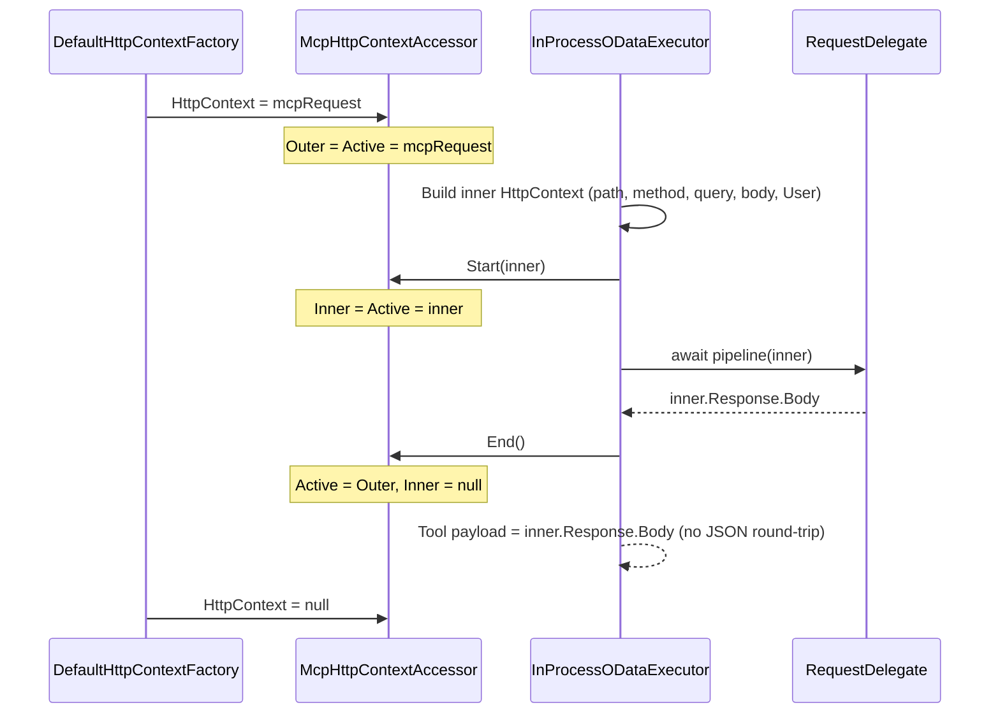

# In-Process OData Execution

**Status:** Draft  
**Date:** 2026-09-15  
**Applies to:** `Microsoft.OData.Mcp.AspNetCore`  
**Branch:** `InProcessODataExecutor-Filter` (implement here; do not invent a second transport)

---

## Overview

The MCP request is already inside the application. Authentication has already run. OData routes are already mapped. Tool execution must invoke **this process’s** request pipeline for `{prefix}/…`. It must not open a second HTTP connection to the same host (no `HttpClient`, no listen-address / port / Kestrel origin, no TestServer `CreateHandler` in product code).

The MCP JSON-RPC envelope stays on the incoming response. The tool payload is the inner OData response body **as written** — do not deserialize OData JSON and serialize it again.

---

## Model

Treat the incoming MCP request as already on the premises. The work is to use the application’s own routing, not to leave the process and re-enter through the server.

`DefaultHttpContextFactory` assigns `IHttpContextAccessor.HttpContext` once at request start and `null` at request end. Nothing in a normal request writes the setter again. Restier is not an MVC controller; it reads `IHttpContextAccessor` and ambient `User`. If that accessor still points at `/odata/mcp` during the inner call, Restier sees the MCP request.

Do not assign Microsoft’s `HttpContextAccessor` setter to nest contexts. That setter nulls a shared holder and ends the outer request. Do not inherit `HttpContextAccessor` (the property is not virtual; the slot is `private static`). Implement `IHttpContextAccessor` and register it last so `GetRequiredService<IHttpContextAccessor>()` returns it (`TryAdd` in `AddHttpContextAccessor` will not overwrite a later `AddSingleton`).

### Holder

| Field | Role |
|-------|------|
| `Outer` | Incoming MCP `HttpContext`. Set only by the accessor setter (host Initialize / Dispose). |
| `Inner` | In-process OData `HttpContext`. Visible to this type only. |
| `Active` | What `HttpContext` get returns. Everyone else only sees this. |

### Setter (`IHttpContextAccessor.HttpContext`)

Always `Outer = Active = value`. If `value` is `null` (host Dispose), also `Inner = null`. Ordinary HTTP traffic never learns `Inner` exists.

### Getter

Always `Active`.

### `Start(HttpContext inner)`

Do **not** use the setter. `Inner = Active = inner`. Restier and the rest of the pipeline now see a normal request.

### `End()`

`Active = Outer`, `Inner = null`. Do not write to `Outer.Response`. The MCP response stream is unchanged. The inner body’s bytes are the tool result.

---

## Sequence



1. Host Initialize: setter loads Outer and Active with the MCP context.
2. Executor builds a **new** `HttpContext` for OData (do not reuse the MCP context). Copy `User`, `Scheme`, `Host`, `PathBase`, and request headers from Outer except hop-by-hop, entity-body, and HTTP conditionals. Set method, path (`/{prefix}/…`), query, JSON body, `Accept: application/json`, `RequestServices` (new DI scope), `Response.Body` to a `MemoryStream`.
3. `Start(inner)` then `await pipeline(inner)` then `End()` in `finally`.
4. Tool success: `inner.Response.Body` is the payload stream. Do not read it into a string on the success path. `ODataToolInvocationResult.ToStructuredContent()` parses that UTF-8 buffer once for `CallToolResult.StructuredContent` (`JsonElement`). Size guard uses `Stream.Length`. Non-success status → `IsError`; error text may read the stream.
5. Host Dispose: setter `null` clears Outer, Active, and Inner.

---

## Pipeline capture

`AddODataMcp` registers an `IStartupFilter` that captures the app `RequestDelegate` (identity `Use` at the start of `Configure`, then `next(app)`). Capture always; it does not turn MCP on.

`UseODataMcp` remains the on switch: `IsEnabled = true`, discover routes, map `{prefix}/mcp`. Execute throws if `UseODataMcp` was not called (`IsEnabled` false or pipeline missing).

Do not capture after `next(app)` (that is only the terminal 404). Do not check `IsEnabled` before capture — on the generic host, `UseODataMcp` runs inside `Configure`, which is `next(app)`.

---

## DI

```csharp
services.AddHttpContextAccessor();
services.TryAddSingleton<McpHttpContextAccessor>();
services.AddSingleton<IHttpContextAccessor>(sp => sp.GetRequiredService<McpHttpContextAccessor>());
```

`InProcessODataExecutor` and `ODataMcpSessionFactory` take `McpHttpContextAccessor`.

Remove named `HttpClient` `"ODataInProcess"`, `BaseAddress`, `SocketsHttpHandler`, and `TryCreateServerHandler` from product code.

---

## What not to do

- Loopback `HttpClient`, `IServerAddressesFeature`, listen ports, forwarded `Host`, TestServer `CreateHandler` in the product package.
- `UseInner` flags or stacks deeper than Outer / Inner / Active.
- Assigning `HttpContextAccessor.HttpContext` to swap (Microsoft setter).
- Inheriting `HttpContextAccessor`.
- Writing OData output onto `Outer.Response`.
- JSON deserialize/serialize of the inner body.
- `Protocol = HTTP/1.1`, Host, or wholesale header copy on the inner context.

---

## Tests

MSTest v3, Breakdance, FluentAssertions. No mocks. Configuration required on every `dotnet` command.

- Accessor: setter loads Outer=Active; Start makes get return Inner while Outer stays; End restores Active to Outer and clears Inner; Dispose (`= null`) clears all; flows across `await`.
- `AddODataMcp`: `IHttpContextAccessor` is the `McpHttpContextAccessor` singleton.
- Executor: pipeline sees accessor.HttpContext === inner; after execute it is outer; inner body is tool JSON without a parse/serialize cycle; `User` is copied; new DI scope per call.
- Host tests stay on `AspNetCoreBreakdanceTestBase`. Restier hosts must call `UseODataMcp`.

---

## Implementation checklist

Follow `Agents.md` (regions, XML docs, `is null`, no private methods except fields, alphabetical members).

1. Replace `McpHttpContextAccessor` with Outer / Inner / Active as specified. No `UseInner`.
2. Keep last-wins DI registration.
3. `InProcessODataExecutor.ExecuteAsync`: build inner context, `Start`, pipeline, `End` in `finally`, payload from inner body stream.
4. Delete product `HttpClient` / `TryCreateServerHandler` / TestServer handler factory usage from the AspNetCore package.
5. Update session factory and tests to `McpHttpContextAccessor`.
6. `dotnet test` `-c Debug` on `Microsoft.OData.Mcp.Tests.AspNetCore` and `Microsoft.OData.Mcp.Tests.AspNetCore.Restier` (`net10.0` at minimum).
7. Do not commit.

---

## Later (out of scope)

This accessor is a candidate for EasyAF.Http as `WrappedHttpContextAccessor` (Restier `$batch` has the same ambient-context problem). Do not add that package in this work.
